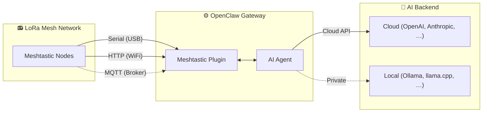

<p align="center">
  
</p>
<h1 align="center">MeshClaw</h1>
<p align="center"><b>Lleva la IA a la mesh — sin Internet</b></p>

<p align="center">
  <a href="https://www.npmjs.com/package/@seeed-studio/meshtastic">
    
  </a>
  <a href="https://www.npmjs.com/package/@seeed-studio/meshtastic">
    
  </a>
  <a href="https://github.com/Seeed-Solution/MeshClaw/stargazers">
    
  </a>
  <a href="https://github.com/Seeed-Solution/MeshClaw/commits/main">
    
  </a>
  <a href="https://github.com/openclaw/openclaw">
    
  </a>
</p>
<!-- LANG_SWITCHER_START -->
<p align="center">
  <a href="README.md">English</a> | <a href="README.zh-CN.md">中文</a> | <a href="README.ja.md">日本語</a> | <a href="README.fr.md">Français</a> | <a href="README.pt.md">Português</a> | <b>Español</b>
</p>
<!-- LANG_SWITCHER_END -->

**MeshClaw** es un plugin de canal para [OpenClaw](https://github.com/openclaw/openclaw) que conecta agentes de IA con redes mesh LoRa de [Meshtastic](https://meshtastic.org/). Envía y recibe mensajes potenciados por IA vía radio — desde la montaña, el océano o cualquier lugar donde no llega la red.



[Documentación][docs] · [Guía de hardware](#hardware-recomendado) · [Reportar bug][issues] · [Solicitar funcionalidad][issues]

## Tabla de contenidos

- [Características](#características)
- [Inicio rápido](#inicio-rápido)
- [Casos de uso](#casos-de-uso)
- [Demo](#demo)
- [Hardware recomendado](#hardware-recomendado)
- [Asistente de configuración](#asistente-de-configuración)
- [Configuración](#1-transporte)
- [Solución de problemas](#2-región-lora)
- [Hoja de ruta](#3-nombre-de-nodo)
- [Desarrollo](#4-acceso-a-canales-grouppolicy)
- [Contribuciones](#5-requerir-mention)

## Características

- Integración con AI Agent — Conecta AI Agents de OpenClaw con redes mesh LoRa de Meshtastic. Funciona con IA en la nube desde el primer momento; opcionalmente, todo local (ver [Hardware](#hardware-recomendado)).
- DM y canales de grupo con control de acceso — Soporta ambos modos de conversación con listas de permitidos para DM, reglas de respuesta por canal y filtrado por @mention
- Soporte multicuenta — Ejecuta múltiples conexiones independientes a la vez
- Comunicación mesh resiliente — Reconexión automática con reintentos configurables. Tolera caídas de conexión sin romperse.

## Inicio rápido

Requisitos previos: Una instancia de [OpenClaw](https://github.com/openclaw/openclaw) en ejecución (Node.js 22+).

```bash
# 1. Install plugin
openclaw plugins install @seeed-studio/meshtastic

# 2. Guided setup — walks you through transport, region, and access policy
openclaw onboard

# 3. Verify
openclaw channels status --probe
```

Tres comandos. Tu IA ya está en la mesh.

<p align="center">
  
</p>

## Casos de uso

- Investigación de campo — Científicos y equipos de prospección consultan bases de conocimiento de IA desde zonas remotas sin cobertura celular
- Respuesta a desastres — Brigadas de emergencia reciben apoyo a la decisión con IA cuando la infraestructura está caída
- Marítimo y aviación — Embarcaciones y aeronaves mantienen interacción con IA lejos de la costa o estaciones terrestres
- Comunidades fuera de la red — Poblaciones rurales o de frontera acceden a herramientas de IA vía redes mesh comunitarias
- Operaciones con privacidad primero — Empareja con un LLM local para despliegues aislados (air-gapped) donde la soberanía del dato importa
- Puente entre canales — Envía desde LoRa fuera de la red y recibe la respuesta de la IA en Telegram, Discord o cualquier canal de OpenClaw

## Demo

<div align="center">

https://github.com/user-attachments/assets/837062d9-a5bb-4e0a-b7cf-298e4bdf2f7c

</div>

Alternativa: [media/demo.mp4](media/demo.mp4)

<p align="center">
  
  &nbsp;&nbsp;
  
</p>

<p align="center">
  <em>Izquierda: consultas a conocimiento de IA sin conexión vía LoRa · Derecha: puente entre canales — envías desde la mesh, recibes en Telegram</em>
</p>

## Hardware recomendado

<p align="center">
  
</p>

| Dispositivo                   | Ideal para                         | Enlace            |
| ----------------------------- | ---------------------------------- | ----------------- |
| XIAO ESP32S3 + Wio-SX1262 kit | Desarrollo de entrada              | [Comprar][hw-xiao]     |
| Wio Tracker L1 Pro            | Gateway de campo portátil          | [Comprar][hw-wio]      |
| SenseCAP Card Tracker T1000-E | Rastreador compacto                | [Comprar][hw-sensecap] |

> **Host de gateway: [reComputer R1024][hw-r1024]** — No necesitas un Mac Mini. El reComputer R1024 (~$189, ~5 W) es un ordenador edge industrial sin ventilador que ejecuta OpenClaw 24/7. Alimentado por PoE, montable en riel DIN, con doble Ethernet y módulos opcionales LoRa/4G — ideal como gateway siempre encendido en el campo. [Guía de inicio →][wiki-openclaw-recomputer]

> Opcional: pila de IA totalmente offline — ¿Quieres cero dependencia de la nube? Añade un [reComputer serie J][hw-recomputer] ejecutando un LLM local (via Ollama, llama.cpp, etc.) y toda la cadena — radio, gateway e inferencia — queda en tu propio hardware. Sin API keys, ningún dato sale de tu red.

¿Sin hardware? El transporte MQTT conecta vía broker — no necesitas un dispositivo local.

Cualquier dispositivo compatible con Meshtastic funciona.

## Asistente de configuración

Ejecutar `openclaw onboard` abre un asistente interactivo que te guía por cada paso de configuración. Abajo verás qué significa cada paso y cómo elegir.

### 1. Transporte

Cómo se conecta el gateway a la mesh de Meshtastic:

| Opción            | Descripción                                                  | Requiere                                         |
| ----------------- | ------------------------------------------------------------ | ------------------------------------------------ |
| **Serial** (USB)  | Conexión USB directa a un dispositivo local. Detecta puertos disponibles automáticamente. | Dispositivo Meshtastic conectado por USB         |
| **HTTP** (WiFi)   | Conecta a un dispositivo por red local.                      | IP o nombre de host del dispositivo (p. ej. `meshtastic.local`)  |
| **MQTT** (broker) | Conecta a la mesh vía un broker MQTT — no necesitas hardware local. | Dirección del broker, credenciales y topic de suscripción |

### 2. Región LoRa

> Solo Serial y HTTP. En MQTT la región se deduce del topic de suscripción.

Configura la región de frecuencias de radio en el dispositivo. Debe cumplir la normativa local y coincidir con los otros nodos de la mesh. Opciones comunes:

| Región   | Frecuencia           |
| -------- | -------------------- |
| `US`     | 902–928 MHz          |
| `EU_868` | 869 MHz              |
| `CN`     | 470–510 MHz          |
| `JP`     | 920 MHz              |
| `UNSET`  | Mantener valor por defecto del dispositivo |

Consulta la [documentación de regiones de Meshtastic](https://meshtastic.org/docs/getting-started/initial-config/#lora) para la lista completa.

### 3. Nombre de nodo

El nombre visible del dispositivo en la mesh. También se usa como disparador de **@mention** en canales de grupo — otros usuarios envían `@OpenClaw` para hablar con tu bot.

- Serial / HTTP: opcional — si lo dejas vacío, se detecta automáticamente del dispositivo conectado.
- MQTT: obligatorio — no hay un dispositivo físico del cual leer el nombre.

### 4. Acceso a canales (`groupPolicy`)

Controla si (y cómo) el bot responde en **canales de grupo** de la mesh (p. ej. LongFast, Emergency):

| Política             | Comportamiento                                              |
| -------------------- | ----------------------------------------------------------- |
| `disabled` (por defecto) | Ignora todos los mensajes de canales de grupo. Solo se procesan DMs. |
| `open`               | Responde en **todos** los canales de la mesh.              |
| `allowlist`          | Responde solo en los canales **listados**. Se te pedirá ingresar nombres de canal (separados por comas, p. ej. `LongFast, Emergency`). Usa `*` como comodín para coincidir con todos. |

### 5. Requerir @mention

> Solo aparece cuando el acceso a canales está habilitado (no `disabled`).

Si está activado (predeterminado: sí), el bot solo responde en canales de grupo cuando alguien menciona su nombre de nodo (p. ej. `@OpenClaw ¿cómo está el clima?`). Esto evita que el bot responda a cada mensaje del canal.

Si está desactivado, el bot responde a **todos** los mensajes en los canales permitidos.

### 6. Política de acceso a mensajes directos (DM) (`dmPolicy`)

Controla quién puede enviar **mensajes directos** al bot:

| Política            | Comportamiento                                              |
| ------------------- | ----------------------------------------------------------- |
| `pairing` (por defecto) | Nuevos remitentes disparan una solicitud de emparejamiento que debe aprobarse antes de chatear. |
| `open`              | Cualquiera en la mesh puede enviar DMs al bot libremente.   |
| `allowlist`         | Solo los nodos listados en `allowFrom` pueden enviar DMs. El resto se ignora. |

### 7. Lista de permitidos de DM (`allowFrom`)

> Solo aparece cuando `dmPolicy` es `allowlist`, o cuando el asistente determina que hace falta.

Una lista de IDs de usuario de Meshtastic permitidos para enviar mensajes directos. Formato: `!aabbccdd` (ID de usuario en hex). Varias entradas separadas por comas.

<p align="center">
  
</p>

### 8. Nombres visibles de cuentas

> Solo aparece en configuraciones multicuenta. Opcional.

Asigna nombres legibles a tus cuentas. Por ejemplo, una cuenta con ID `home` podría mostrarse como "Home Station". Si lo omites, se usa el ID de cuenta tal cual. Es puramente cosmético y no afecta la funcionalidad.

## Configuración

El asistente (`openclaw onboard`) cubre todo lo de abajo. Para configurar manualmente, edita con `openclaw config edit`.

### Serial (USB)

```yaml
channels:
  meshtastic:
    transport: serial
    serialPort: /dev/ttyUSB0
    nodeName: OpenClaw
```

### HTTP (WiFi)

```yaml
channels:
  meshtastic:
    transport: http
    httpAddress: meshtastic.local
    nodeName: OpenClaw
```

### MQTT (broker)

```yaml
channels:
  meshtastic:
    transport: mqtt
    nodeName: OpenClaw
    mqtt:
      broker: mqtt.meshtastic.org
      username: meshdev
      password: large4cats
      topic: "msh/US/2/json/#"
```

### Multicuenta

```yaml
channels:
  meshtastic:
    accounts:
      home:
        transport: serial
        serialPort: /dev/ttyUSB0
      remote:
        transport: mqtt
        mqtt:
          broker: mqtt.meshtastic.org
          topic: "msh/US/2/json/#"
```

<details>
<summary><b>Referencia de todas las opciones</b></summary>

| Clave               | Tipo                           | Predeterminado        | Notas                                                        |
| ------------------- | ------------------------------ | --------------------- | ------------------------------------------------------------ |
| `transport`         | `serial \| http \| mqtt`       | `serial`              |                                                              |
| `serialPort`        | `string`                       | —                     | Requerido para serial                                        |
| `httpAddress`       | `string`                       | `meshtastic.local`    | Requerido para HTTP                                          |
| `httpTls`           | `boolean`                      | `false`               |                                                              |
| `mqtt.broker`       | `string`                       | `mqtt.meshtastic.org` |                                                              |
| `mqtt.port`         | `number`                       | `1883`                |                                                              |
| `mqtt.username`     | `string`                       | `meshdev`             |                                                              |
| `mqtt.password`     | `string`                       | `large4cats`          |                                                              |
| `mqtt.topic`        | `string`                       | `msh/US/2/json/#`     | Topic de suscripción                                         |
| `mqtt.publishTopic` | `string`                       | derived               |                                                              |
| `mqtt.tls`          | `boolean`                      | `false`               |                                                              |
| `region`            | enum                           | `UNSET`               | `US`, `EU_868`, `CN`, `JP`, `ANZ`, `KR`, `TW`, `RU`, `IN`, `NZ_865`, `TH`, `EU_433`, `UA_433`, `UA_868`, `MY_433`, `MY_919`, `SG_923`, `LORA_24`. Solo Serial/HTTP. |
| `nodeName`          | `string`                       | auto-detect           | Nombre visible y disparador de @mention. Requerido para MQTT. |
| `dmPolicy`          | `open \| pairing \| allowlist` | `pairing`             | Quién puede enviar mensajes directos. Ver [Política de acceso a mensajes directos (DM)](#6-política-de-acceso-a-mensajes-directos-dmpolicy). |
| `allowFrom`         | `string[]`                     | —                     | IDs de nodo para la lista de permitidos de DM, p. ej. `["!aabbccdd"]` |
| `groupPolicy`       | `open \| allowlist \| disabled`| `disabled`            | Política de respuesta en canales de grupo. Ver [Acceso a canales](#4-acceso-a-canales-grouppolicy). |
| `channels`          | `Record<string, object>`       | —                     | Configuración por canal: `requireMention`, `allowFrom`, `tools` |

</details>

<details>
<summary><b>Overrides mediante variables de entorno</b></summary>

Estas variables sobrescriben la configuración de la cuenta por defecto (el YAML tiene prioridad para cuentas con nombre):

| Variable                  | Clave de configuración equivalente |
| ------------------------- | ---------------------------------- |
| `MESHTASTIC_TRANSPORT`    | `transport`                        |
| `MESHTASTIC_SERIAL_PORT`  | `serialPort`                       |
| `MESHTASTIC_HTTP_ADDRESS` | `httpAddress`                      |
| `MESHTASTIC_MQTT_BROKER`  | `mqtt.broker`                      |
| `MESHTASTIC_MQTT_TOPIC`   | `mqtt.topic`                       |

</details>

## Solución de problemas

| Síntoma              | Revisa                                                      |
| -------------------- | ----------------------------------------------------------- |
| Serial no conecta    | ¿Ruta del dispositivo correcta? ¿El host tiene permisos?   |
| HTTP no conecta      | ¿`httpAddress` es alcanzable? ¿`httpTls` coincide con el dispositivo? |
| MQTT no recibe nada  | ¿La región en `mqtt.topic` es correcta? ¿Credenciales del broker válidas? |
| No hay respuestas por DM | ¿`dmPolicy` y `allowFrom` configurados? Ver [Política de acceso a mensajes directos (DM)](#6-política-de-acceso-a-mensajes-directos-dmpolicy). |
| No hay respuestas en grupo | ¿`groupPolicy` habilitado? ¿El canal está en la lista de permitidos? ¿Requiere @mention? Ver [Acceso a canales](#4-acceso-a-canales-grouppolicy). |

¿Encontraste un bug? [Abre una issue][issues] con el tipo de transporte, la configuración (sin secretos) y la salida de `openclaw channels status --probe`.

## Hoja de ruta

Planeamos ingerir datos de nodos en tiempo real (ubicación GPS, sensores ambientales, estado del dispositivo) en el contexto de OpenClaw, habilitando que la IA monitoree la salud de la red mesh y emita alertas proactivas — sin esperar a que el usuario pregunte.

## Desarrollo

```bash
git clone https://github.com/Seeed-Solution/MeshClaw.git
cd MeshClaw
npm install
openclaw plugins install -l ./MeshClaw
```

Sin paso de build — OpenClaw carga el código TypeScript directamente. Usa `openclaw channels status --probe` para verificar.

## Contribuciones

¡Toda contribución es bienvenida!

- Reportes de bugs y solicitudes de funcionalidades — [Abre una issue][issues]
- Contribuciones de código — Haz fork del repositorio, crea una rama y envía un Pull Request. Mantén el código alineado con las convenciones existentes de TypeScript.
- Documentación y traducciones — Siempre se agradecen mejoras de docs y nuevas traducciones.

Mira [Desarrollo](#desarrollo) para instrucciones de setup local.

---

Si MeshClaw te resulta útil, déjanos una estrella ⭐ — ¡ayuda a que más gente descubra el proyecto!

<!-- Reference-style links -->
[docs]: https://meshtastic.org/docs/
[issues]: https://github.com/Seeed-Solution/MeshClaw/issues
[hw-xiao]: https://www.seeedstudio.com/Wio-SX1262-with-XIAO-ESP32S3-p-5982.html
[hw-wio]: https://www.seeedstudio.com/Wio-Tracker-L1-Pro-p-6454.html
[hw-sensecap]: https://www.seeedstudio.com/SenseCAP-Card-Tracker-T1000-E-for-Meshtastic-p-5913.html
[hw-recomputer]: https://www.seeedstudio.com/reComputer-J4012-p-5586.html
[hw-r1024]: https://www.seeedstudio.com/reComputer-R1024-10-p-5923.html
[wiki-openclaw-recomputer]: https://wiki.seeedstudio.com/getting_started_with_openclaw_on_recomputer/