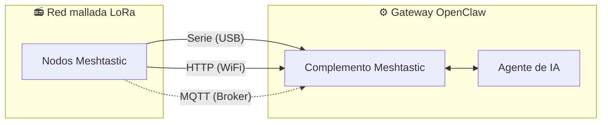

<think>**Translating README content**

I need to translate the README markdown to Spanish while keeping the original structure, including code blocks and links. The request is clear: I have to produce a Spanish version of the entire text without added formatting. 

Okay, there's a language switcher. Since it's now in Spanish, I'll probably need to bold "Español" and link it to README.es.md, while keeping the English bold and linked to README.md. I'll adjust the switcher to fit the translated context!**Considering language switcher in translation**

The task is translating the markdown. I’m thinking about whether to keep the language switcher the way it originally is or switch to Spanish, bolding "Español" and linking to README.es.md for the Spanish version.  

Since the instruction is just to translate, it might be fine to keep the links as they are, but usually, translation tasks involve updating the language switcher. It might be best to maintain the exact markup, but I could potentially translate the language names into Spanish.**Deciding on language names**

I’m considering how to handle the language names in the translation, particularly for the Spanish version. Typically, you'd replace "English" with "Inglés," while keeping the other languages listed in their native forms.  

However, the instruction is just to translate the README markdown. So it might be safer to leave the language names unchanged for consistency. For the language switcher in the Spanish version, I want to bold "Español" while keeping the links as they are. But the Spanish file should mark "Español" bold and link to the other language files.**Modifying language links**

I’m thinking about how to adjust the language links in the README for the Spanish version. I'll modify it to show <b>Español</b> without a link, while providing links for the other languages. For English, I can link to README.md. 

In the original, they didn’t link "English" because it's the current document, but I can mirror that by making <a href="README.md">English</a> clickable. I also need to consider the "IMPORTANT" blockquote. I'll translate "IMPORTANT" to "IMPORTANTE" but keep the bracket tag [!IMPORTANT] so it renders correctly on GitHub.</think>

<p align="center">
  
</p>

# MeshClaw: Complemento de canal Meshtastic para OpenClaw

<p align="center">
  <a href="https://www.npmjs.com/package/@seeed-studio/meshtastic">
    
  </a>
  <a href="https://www.npmjs.com/package/@seeed-studio/meshtastic">
    
  </a>
</p>

<!-- LANG_SWITCHER_START -->
<p align="center">
  <a href="README.md">English</a> | <a href="README.zh-CN.md">中文</a> | <a href="README.ja.md">日本語</a> | <a href="README.fr.md">Français</a> | <a href="README.pt.md">Português</a> | <b>Español</b>
</p>
<!-- LANG_SWITCHER_END -->

**MeshClaw** es un complemento de canal para OpenClaw que permite a tu gateway de IA enviar y recibir mensajes a través de Meshtastic — sin internet, sin torres celulares, solo ondas de radio. Habla con tu asistente de IA desde la montaña, el océano o cualquier lugar fuera de la red.

⭐ Danos una estrella en GitHub — ¡nos motiva mucho!

> [!IMPORTANT]
> Este es un **complemento de canal** para el gateway de IA [OpenClaw](https://github.com/openclaw/openclaw) — no es una aplicación independiente. Necesitas una instancia de OpenClaw en ejecución (Node.js 22+) para usarlo.

[Documentación][docs] · [Guía de hardware](#hardware-recomendado) · [Reportar bug][issues] · [Solicitar función][issues]

## Tabla de contenidos

- [Cómo funciona](#cómo-funciona)
- [Hardware recomendado](#hardware-recomendado)
- [Características](#características)
- [Capacidades y hoja de ruta](#capacidades-y-hoja-de-ruta)
- [Demo](#demo)
- [Inicio rápido](#inicio-rápido)
- [Asistente de configuración](#asistente-de-configuración)
- [Configuración](#configuración)
- [Solución de problemas](#solución-de-problemas)
- [Desarrollo](#desarrollo)
- [Contribuir](#contribuir)

## Cómo funciona



El complemento hace de puente entre dispositivos LoRa Meshtastic y el agente de IA de OpenClaw. Admite tres modos de transporte:

- **Serial** — conexión USB directa a un dispositivo Meshtastic local
- **HTTP** — se conecta a un dispositivo por WiFi / red local
- **MQTT** — se suscribe a un broker MQTT de Meshtastic, sin necesidad de hardware local

Los mensajes entrantes pasan por control de acceso (política de DM, política de grupos, requisito de mención) antes de llegar a la IA. Las respuestas salientes se limpian del formato markdown (los dispositivos LoRa no pueden renderizarlo) y se fragmentan para ajustarse a los límites de tamaño de los paquetes de radio.

## Hardware recomendado

<p align="center">
  
</p>

| Dispositivo                    | Ideal para               | Enlace            |
| ----------------------------- | ------------------------ | ----------------- |
| Kit XIAO ESP32S3 + Wio-SX1262 | Desarrollo de entrada    | [Comprar][hw-xiao]     |
| Wio Tracker L1 Pro            | Gateway portátil de campo | [Comprar][hw-wio]      |
| SenseCAP Card Tracker T1000-E | Rastreador compacto      | [Comprar][hw-sensecap] |

¿Sin hardware? El transporte por MQTT se conecta vía broker — no se requiere dispositivo local.

Cualquier dispositivo compatible con Meshtastic funciona.

## Características

- **Integración con agentes de IA** — Conecta agentes de IA de OpenClaw con redes malladas LoRa Meshtastic. Comunicación inteligente sin dependencia de la nube.

- **Tres modos de transporte** — Compatibilidad con Serial (USB), HTTP (WiFi) y MQTT

- **DM y canales de grupo con control de acceso** — Admite ambos modos de conversación con listas de permitidos para DM, reglas de respuesta por canal y requisito de mención

- **Soporte multi-cuenta** — Ejecuta múltiples conexiones independientes simultáneamente

- **Comunicación de malla resiliente** — Reconexión automática con reintentos configurables. Maneja caídas de conexión con elegancia.

## Capacidades y hoja de ruta

El complemento trata Meshtastic como un canal de primera clase — igual que Telegram o Discord — habilitando conversaciones de IA e invocación de herramientas completamente por radio LoRa, sin depender de internet.

| Consultar información sin conexión                         | Puente entre canales: envía fuera de la red, recibe donde sea | 🔜 Próximamente:                                               |
| ---------------------------------------------------------- | -------------------------------------------------------------- | -------------------------------------------------------------- |
|  |       | Planeamos incorporar datos en tiempo real de los nodos (ubicación GPS, sensores ambientales, estado del dispositivo) en el contexto de OpenClaw, permitiendo que la IA supervise la salud de la red y emita alertas proactivas sin esperar a consultas de usuarios. |

## Demo

<div align="center">

https://github.com/user-attachments/assets/837062d9-a5bb-4e0a-b7cf-298e4bdf2f7c

</div>

Alternativa: [media/demo.mp4](media/demo.mp4)

## Inicio rápido

```bash
# 1. Instalar el complemento
openclaw plugins install @seeed-studio/meshtastic

# 2. Configuración guiada — te guía por transporte, región y política de acceso
openclaw onboard

# 3. Verificar
openclaw channels status --probe
```

<p align="center">
  
</p>

## Asistente de configuración

Ejecutar `openclaw onboard` inicia un asistente interactivo que te guía por cada paso de la configuración. A continuación, qué significa cada paso y cómo elegir.

### 1. Transporte

Cómo el gateway se conecta a la malla Meshtastic:

| Opción             | Descripción                                                   | Requisitos                                       |
| ------------------ | ------------------------------------------------------------- | ------------------------------------------------ |
| **Serial** (USB)   | Conexión USB directa a un dispositivo local. Detecta puertos disponibles automáticamente. | Dispositivo Meshtastic conectado por USB         |
| **HTTP** (WiFi)    | Se conecta a un dispositivo por la red local.                 | IP o hostname del dispositivo (p. ej. `meshtastic.local`) |
| **MQTT** (broker)  | Se conecta a la malla mediante un broker MQTT — sin hardware local. | Dirección del broker, credenciales y tópico de suscripción |

### 2. Región LoRa

> Solo Serial y HTTP. MQTT deriva la región del tópico de suscripción.

Configura la región de frecuencia de radio en el dispositivo. Debe coincidir con la normativa local y con otros nodos de la malla. Opciones comunes:

| Región   | Frecuencia          |
| -------- | ------------------- |
| `US`     | 902–928 MHz         |
| `EU_868` | 869 MHz             |
| `CN`     | 470–510 MHz         |
| `JP`     | 920 MHz             |
| `UNSET`  | Mantener por defecto del dispositivo |

Consulta la [documentación de regiones de Meshtastic](https://meshtastic.org/docs/getting-started/initial-config/#lora) para la lista completa.

### 3. Nombre de nodo

El nombre visible del dispositivo en la malla. También se usa como el **disparador @mención** en canales de grupo — otros usuarios envían `@OpenClaw` para hablar con tu bot.

- **Serial / HTTP**: opcional — se detecta automáticamente del dispositivo conectado si se deja vacío.
- **MQTT**: requerido — no hay dispositivo físico del que leer el nombre.

### 4. Acceso a canales (`groupPolicy`)

Controla si y cómo el bot responde en **canales de grupo** de la malla (p. ej. LongFast, Emergency):

| Política             | Comportamiento                                               |
| -------------------- | ------------------------------------------------------------ |
| `disabled` (por defecto) | Ignora todos los mensajes de canales de grupo. Solo se procesan DMs. |
| `open`               | Responde en **todos** los canales de la malla.              |
| `allowlist`          | Responde solo en los **canales listados**. Se te pedirá ingresar nombres de canal (separados por comas, p. ej. `LongFast, Emergency`). Usa `*` como comodín para coincidir con todos. |

### 5. Requerir mención

> Solo aparece cuando el acceso a canales está habilitado (no `disabled`).

Cuando está habilitado (predeterminado: **sí**), el bot solo responde en canales de grupo cuando alguien menciona su nombre de nodo (p. ej. `@OpenClaw ¿cómo está el clima?`). Esto evita que el bot responda a cada mensaje del canal.

Si se deshabilita, el bot responde a **todos** los mensajes en los canales permitidos.

### 6. Política de acceso por DM (`dmPolicy`)

Controla quién puede enviar **mensajes directos** al bot:

| Política             | Comportamiento                                               |
| -------------------- | ------------------------------------------------------------ |
| `pairing` (por defecto) | Los nuevos remitentes activan una solicitud de emparejamiento que debe aprobarse antes de poder chatear. |
| `open`               | Cualquiera en la malla puede enviar DM libremente.          |
| `allowlist`          | Solo los nodos listados en `allowFrom` pueden enviar DM. El resto se ignora. |

### 7. Lista de permitidos para DM (`allowFrom`)

> Solo aparece cuando `dmPolicy` es `allowlist`, o cuando el asistente determina que se necesita.

Una lista de IDs de usuario Meshtastic permitidos para enviar mensajes directos. Formato: `!aabbccdd` (ID de usuario en hex). Entradas múltiples separadas por comas.

<p align="center">
  
</p>

### 8. Nombres visibles de cuentas

> Solo aparece para configuraciones multi-cuenta. Opcional.

Asigna nombres legibles a tus cuentas. Por ejemplo, una cuenta con ID `home` podría mostrarse como "Estación Casa". Si se omite, se usa el ID de cuenta tal cual. Es solo cosmético y no afecta la funcionalidad.

## Configuración

La configuración guiada (`openclaw onboard`) cubre todo lo siguiente. Consulta el [Asistente de configuración](#asistente-de-configuración) para una guía paso a paso. Para configurar manualmente, edita con `openclaw config edit`.

### Serial (USB)

```yaml
channels:
  meshtastic:
    transport: serial
    serialPort: /dev/ttyUSB0
    nodeName: OpenClaw
```

### HTTP (WiFi)

```yaml
channels:
  meshtastic:
    transport: http
    httpAddress: meshtastic.local
    nodeName: OpenClaw
```

### MQTT (broker)

```yaml
channels:
  meshtastic:
    transport: mqtt
    nodeName: OpenClaw
    mqtt:
      broker: mqtt.meshtastic.org
      username: meshdev
      password: large4cats
      topic: "msh/US/2/json/#"
```

### Multi-cuenta

```yaml
channels:
  meshtastic:
    accounts:
      home:
        transport: serial
        serialPort: /dev/ttyUSB0
      remote:
        transport: mqtt
        mqtt:
          broker: mqtt.meshtastic.org
          topic: "msh/US/2/json/#"
```

<details>
<summary><b>Referencia de todas las opciones</b></summary>

| Clave               | Tipo                            | Predeterminado        | Notas                                                        |
| ------------------- | ------------------------------- | --------------------- | ------------------------------------------------------------ |
| `transport`         | `serial \| http \| mqtt`        | `serial`              |                                                              |
| `serialPort`        | `string`                        | —                     | Requerido para serial                                        |
| `httpAddress`       | `string`                        | `meshtastic.local`    | Requerido para HTTP                                          |
| `httpTls`           | `boolean`                       | `false`               |                                                              |
| `mqtt.broker`       | `string`                        | `mqtt.meshtastic.org` |                                                              |
| `mqtt.port`         | `number`                        | `1883`                |                                                              |
| `mqtt.username`     | `string`                        | `meshdev`             |                                                              |
| `mqtt.password`     | `string`                        | `large4cats`          |                                                              |
| `mqtt.topic`        | `string`                        | `msh/US/2/json/#`     | Tópico de suscripción                                        |
| `mqtt.publishTopic` | `string`                        | derivado              |                                                              |
| `mqtt.tls`          | `boolean`                       | `false`               |                                                              |
| `region`            | enum                            | `UNSET`               | `US`, `EU_868`, `CN`, `JP`, `ANZ`, `KR`, `TW`, `RU`, `IN`, `NZ_865`, `TH`, `EU_433`, `UA_433`, `UA_868`, `MY_433`, `MY_919`, `SG_923`, `LORA_24`. Solo Serial/HTTP. |
| `nodeName`          | `string`                        | auto-detect           | Nombre visible y disparador de @mención. Requerido para MQTT. |
| `dmPolicy`          | `open \| pairing \| allowlist`  | `pairing`             | Quién puede enviar mensajes directos. Ver [Política de acceso por DM](#6-política-de-acceso-por-dm-dmpolicy). |
| `allowFrom`         | `string[]`                      | —                     | IDs de nodo para la lista de permitidos de DM, p. ej. `["!aabbccdd"]` |
| `groupPolicy`       | `open \| allowlist \| disabled` | `disabled`            | Política de respuesta en canales de grupo. Ver [Acceso a canales](#4-acceso-a-canales-grouppolicy). |
| `channels`          | `Record<string, object>`        | —                     | Configuración por canal: `requireMention`, `allowFrom`, `tools` |

</details>

<details>
<summary><b>Variables de entorno que sobrescriben</b></summary>

Estas sobrescriben la configuración de la cuenta por defecto (el YAML tiene prioridad para cuentas nombradas):

| Variable                   | Clave de configuración equivalente |
| -------------------------- | ---------------------------------- |
| `MESHTASTIC_TRANSPORT`     | `transport`                        |
| `MESHTASTIC_SERIAL_PORT`   | `serialPort`                       |
| `MESHTASTIC_HTTP_ADDRESS`  | `httpAddress`                      |
| `MESHTASTIC_MQTT_BROKER`   | `mqtt.broker`                      |
| `MESHTASTIC_MQTT_TOPIC`    | `mqtt.topic`                       |

</details>

## Solución de problemas

| Síntoma              | Verifique                                                    |
| -------------------- | ------------------------------------------------------------ |
| No conecta por Serial | ¿Ruta del dispositivo correcta? ¿El host tiene permisos?     |
| No conecta por HTTP  | ¿`httpAddress` es accesible? ¿`httpTls` coincide con el dispositivo? |
| MQTT no recibe nada  | ¿La región en `mqtt.topic` es correcta? ¿Credenciales del broker válidas? |
| Sin respuestas en DM | ¿`dmPolicy` y `allowFrom` configurados? Ver [Política de acceso por DM](#6-política-de-acceso-por-dm-dmpolicy). |
| Sin respuestas en grupo | ¿`groupPolicy` habilitada? ¿Canal en la lista de permitidos? ¿Se requiere mención? Ver [Acceso a canales](#4-acceso-a-canales-grouppolicy). |

¿Encontraste un bug? [Abre un issue][issues] indicando el tipo de transporte, la configuración (oculta secretos) y la salida de `openclaw channels status --probe`.

## Desarrollo

```bash
git clone https://github.com/Seeed-Solution/MeshClaw.git
cd MeshClaw
npm install
openclaw plugins install -l ./MeshClaw
```

Sin paso de build — OpenClaw carga directamente el código fuente TypeScript. Usa `openclaw channels status --probe` para verificar.

## Contribuir

- [Abre un issue][issues] para bugs o solicitudes de funciones
- Pull requests bienvenidos — mantén el código alineado con las convenciones existentes de TypeScript

<!-- Enlaces de referencia -->
[docs]: https://meshtastic.org/docs/
[issues]: https://github.com/Seeed-Solution/MeshClaw/issues
[hw-xiao]: https://www.seeedstudio.com/Wio-SX1262-with-XIAO-ESP32S3-p-5982.html
[hw-wio]: https://www.seeedstudio.com/Wio-Tracker-L1-Pro-p-6454.html
[hw-sensecap]: https://www.seeedstudio.com/SenseCAP-Card-Tracker-T1000-E-for-Meshtastic-p-5913.html