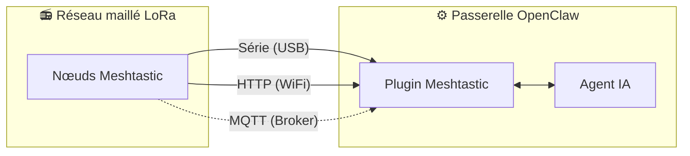

<think>**Translating README to French**

I need to translate the README markdown that the user provided into French. Since they pasted the markdown, they likely want to keep the formatting intact, including code blocks. The user specifically asked for it to be translated, so I should preserve the structure, titles, and headings. I'll maintain code and CLI commands as they are, translating only text elements like paragraphs and bullet points while keeping links unchanged. I'll also ensure that language names are in French for the switcher.**Adjusting language switcher for French**

For the French version, I should bold "Français" and adjust the other language links accordingly. The original README included a list that starts with <b>English</b>, but for the French version, I'll want "Français" to be bold instead. While keeping the links unchanged, I’ll ensure the link for "English" points to README.md, as the original text isn't formatted correctly. So, in the French README, it’ll feature links like <a href="README.md">English</a> | <b>Français</b>.**Translating README with language switcher**

In the language switcher, I see that "English" is bolded but not linked, while others are linked to their respective files. For the French version, I should probably format it as <a href="README.md">English</a> | 中文 | 日本語 | <b>Français</b>. The user specifically asked for a translation and didn’t mention adjusting links, but making "Français" active is helpful. 

I also need to keep the Mermaid code as is, translating labels like "Meshtastic Nodes" and content in tables to French, ensuring that images' alt texts are translated too. The "Demo" link will remain unchanged, and the "Fallback:" text will be translated as well.**Translating command line comments and documentation**

For the command lines, I need to translate comments that start with # within the code block, but I won't change the commands. JSON keys like "channels," "transport," and "nodeName" will stay the same. I should also translate the "IMPORTANT" admonition block while keeping its format.

For references like "Documentation [docs]," I'll keep the bracket references unchanged, but change "Report Bug" to "Signaler un bug" and "Request Feature" to "Demander une fonctionnalité." For settings, "Multi-account" translates to "Multi-compte." The detailed options table headers should be translated as well, while keeping values in backticks and translating the notes. The "Region" enumeration list will remain unchanged.**Translating technical terms and README content**

I need to ensure I'm using accurate French technical terms throughout. For "passerelle," that translates to "gateway," and "maillage" for "mesh network." When it comes to DM, I think I should keep that and clarify it as "DM (messages privés)." "Allowlist" will become "liste d’autorisation," while "Mention gating" translates to "contrôle par mention."

Other translations include "Node Name" to "Nom du nœud," and I’ll keep terms like "broker MQTT" since they're widely understood. 

For product names like "XIAO ESP32S3 + Wio-SX1262 kit," I’ll leave those unchanged. I want to ensure clarity and consistency in things like "Assistant de configuration" for "Setup Wizard" and translate "No internet, no cell towers" to "Pas d'internet, pas d'antennes cellulaires." 

I'll also convert the environment variables table description to French and ensure the Markdown format remains clean while keeping reference links unchanged. Finally, I’ll carefully draft the full translated README markup, making sure not to miss any details or create new information.</think>

<p align="center">
  
</p>

# MeshClaw : Plugin de canal Meshtastic pour OpenClaw

<p align="center">
  <a href="https://www.npmjs.com/package/@seeed-studio/meshtastic">
    
  </a>
  <a href="https://www.npmjs.com/package/@seeed-studio/meshtastic">
    
  </a>
</p>

<!-- LANG_SWITCHER_START -->
<p align="center">
  <a href="README.md">English</a> | <a href="README.zh-CN.md">中文</a> | <a href="README.ja.md">日本語</a> | <b>Français</b> | <a href="README.pt.md">Português</a> | <a href="README.es.md">Español</a>
</p>
<!-- LANG_SWITCHER_END -->

MeshClaw est un plugin de canal OpenClaw qui permet à votre passerelle IA d’envoyer et de recevoir des messages via Meshtastic — pas d’internet, pas d’antennes cellulaires, seulement des ondes radio. Parlez à votre assistant IA depuis la montagne, l’océan, ou n’importe où hors réseau.

⭐ Mettez-nous une étoile sur GitHub — ça nous motive beaucoup !

> [!IMPORTANT]
> Il s’agit d’un plugin de canal pour la passerelle IA OpenClaw — et non d’une application autonome. Vous avez besoin d’une instance OpenClaw (Node.js 22+) en cours d’exécution pour l’utiliser.

[Documentation][docs] · [Guide matériel](#matériel-recommandé) · [Signaler un bug][issues] · [Demander une fonctionnalité][issues]

## Table des matières

- [Fonctionnement](#fonctionnement)
- [Matériel recommandé](#matériel-recommandé)
- [Fonctionnalités](#fonctionnalités)
- [Capacités et feuille de route](#capacités-et-feuille-de-route)
- [Démo](#démo)
- [Démarrage rapide](#démarrage-rapide)
- [Assistant de configuration](#assistant-de-configuration)
- [Configuration](#configuration)
- [Dépannage](#dépannage)
- [Développement](#développement)
- [Contribuer](#contribuer)

## Fonctionnement



Le plugin fait le pont entre les appareils LoRa Meshtastic et l’agent IA OpenClaw. Il prend en charge trois modes de transport :

- Série — connexion USB directe à un appareil Meshtastic local
- HTTP — connexion à un appareil via WiFi / réseau local
- MQTT — abonnement à un broker MQTT Meshtastic, sans matériel local

Les messages entrants passent par un contrôle d’accès (politique DM, politique de groupe, filtrage par mention) avant d’atteindre l’IA. Les réponses sortantes sont dépourvues de mise en forme markdown (les appareils LoRa ne peuvent pas l’afficher) et découpées pour respecter les limites de taille des paquets radio.

## Matériel recommandé

<p align="center">
  
</p>

| Appareil                      | Idéal pour                 | Lien               |
| ---------------------------- | -------------------------- | ------------------ |
| XIAO ESP32S3 + kit Wio-SX1262 | Développement d’entrée de gamme | [Acheter][hw-xiao] |
| Wio Tracker L1 Pro           | Passerelle portable de terrain | [Acheter][hw-wio]  |
| SenseCAP Card Tracker T1000-E | Traceur compact            | [Acheter][hw-sensecap] |

Pas de matériel ? Le transport MQTT se connecte via un broker — aucun appareil local requis.

Tout appareil compatible Meshtastic convient.

## Fonctionnalités

- Intégration d’agent IA — Fait le lien entre les agents IA OpenClaw et les réseaux maillés LoRa Meshtastic. Permet une communication intelligente sans dépendance au cloud.

- Trois modes de transport — Série (USB), HTTP (WiFi) et MQTT

- Canaux DM et de groupe avec contrôle d’accès — Prend en charge les deux modes de conversation avec listes d’autorisation DM, règles de réponse par canal, et filtrage par mention

- Prise en charge multi-compte — Exécute plusieurs connexions indépendantes simultanément

- Communication maillée résiliente — Reconnexion automatique avec tentatives configurables. Gère les coupures de connexion en douceur.

## Capacités et feuille de route

Le plugin traite Meshtastic comme un canal de premier ordre — tout comme Telegram ou Discord — permettant des conversations IA et l’invocation de compétences entièrement via radio LoRa, sans dépendance à internet.

| Interroger des informations hors ligne                         | Passerelle inter-canaux : envoyer hors réseau, recevoir partout | À venir :                                                     |
| -------------------------------------------------------------- | ---------------------------------------------------------------- | ------------------------------------------------------------ |
|  |      | Nous prévoyons d’ingérer les données en temps réel des nœuds (position GPS, capteurs environnementaux, état de l’appareil) dans le contexte d’OpenClaw, permettant à l’IA de surveiller la santé du réseau maillé et de diffuser des alertes proactives sans attendre des requêtes utilisateur. |

## Démo

<div align="center">

https://github.com/user-attachments/assets/837062d9-a5bb-4e0a-b7cf-298e4bdf2f7c

</div>

Solution de repli : [media/demo.mp4](media/demo.mp4)

## Démarrage rapide

```bash
# 1. Installer le plugin
openclaw plugins install @seeed-studio/meshtastic

# 2. Assistant guidé — vous guide sur le transport, la région et la politique d’accès
openclaw onboard

# 3. Vérifier
openclaw channels status --probe
```

<p align="center">
  
</p>

## Assistant de configuration

L’exécution de `openclaw onboard` lance un assistant interactif qui vous guide à travers chaque étape de configuration. Voici ce que signifie chaque étape et comment choisir.

### 1. Transport

Comment la passerelle se connecte au maillage Meshtastic :

| Option             | Description                                                    | Nécessite                                        |
| ------------------ | -------------------------------------------------------------- | ------------------------------------------------ |
| Série (USB)        | Connexion USB directe à un appareil local. Détection automatique des ports disponibles. | Appareil Meshtastic branché en USB               |
| HTTP (WiFi)        | Se connecte à un appareil via le réseau local.                 | Adresse IP ou nom d’hôte (ex. `meshtastic.local`) |
| MQTT (broker)      | Se connecte au maillage via un broker MQTT — aucun matériel local requis. | Adresse du broker, identifiants et topic d’abonnement |

### 2. Région LoRa

> Série et HTTP uniquement. MQTT déduit la région depuis le topic d’abonnement.

Définit la région de fréquence radio sur l’appareil. Doit correspondre à votre réglementation locale et aux autres nœuds du maillage. Choix courants :

| Région   | Fréquence            |
| -------- | -------------------- |
| US       | 902–928 MHz          |
| EU_868   | 869 MHz              |
| CN       | 470–510 MHz          |
| JP       | 920 MHz              |
| UNSET    | Conserver la valeur par défaut de l’appareil |

Voir la documentation Meshtastic sur les régions : https://meshtastic.org/docs/getting-started/initial-config/#lora

### 3. Nom du nœud

Le nom d’affichage de l’appareil sur le maillage. Également utilisé comme déclencheur d’@mention dans les canaux de groupe — les autres utilisateurs envoient `@OpenClaw` pour parler à votre bot.

- Série / HTTP : optionnel — détecté automatiquement depuis l’appareil connecté si laissé vide.
- MQTT : requis — il n’y a pas d’appareil physique pour lire le nom.

### 4. Accès aux canaux (groupPolicy)

Contrôle si et comment le bot répond dans les canaux de groupe du maillage (ex. LongFast, Emergency) :

| Politique            | Comportement                                                  |
| -------------------- | ------------------------------------------------------------- |
| disabled (par défaut) | Ignore tous les messages des canaux de groupe. Seuls les DM sont traités. |
| open                 | Répond dans tous les canaux du maillage.                      |
| allowlist            | Répond uniquement dans les canaux listés. Vous serez invité à saisir des noms de canaux (séparés par des virgules, ex. `LongFast, Emergency`). Utilisez `*` comme joker pour tout faire correspondre. |

### 5. Exiger une mention

> Apparaît uniquement lorsque l’accès aux canaux est activé (pas disabled).

Lorsqu’il est activé (par défaut : oui), le bot ne répond dans les canaux de groupe que lorsque quelqu’un mentionne son nom de nœud (ex. `@OpenClaw quel temps fait-il ?`). Cela évite que le bot réponde à chaque message du canal.

Lorsqu’il est désactivé, le bot répond à tous les messages dans les canaux autorisés.

### 6. Politique d’accès aux DM (dmPolicy)

Contrôle qui peut envoyer des messages directs (DM, messages privés) au bot :

| Politique           | Comportement                                                   |
| ------------------- | -------------------------------------------------------------- |
| pairing (par défaut) | Les nouveaux expéditeurs déclenchent une demande d’appairage qui doit être approuvée avant de pouvoir discuter. |
| open                | N’importe qui sur le maillage peut envoyer des DM au bot librement. |
| allowlist           | Seuls les nœuds listés dans allowFrom peuvent envoyer des DM. Tous les autres sont ignorés. |

### 7. Liste d’autorisation DM (allowFrom)

> Apparaît uniquement lorsque dmPolicy vaut allowlist, ou lorsque l’assistant détermine qu’elle est nécessaire.

Une liste d’ID utilisateurs Meshtastic autorisés à envoyer des messages directs. Format : `!aabbccdd` (ID utilisateur hexadécimal). Plusieurs entrées séparées par des virgules.

<p align="center">
  
</p>

### 8. Noms d’affichage des comptes

> Apparaît uniquement pour les configurations multi-compte. Optionnel.

Attribue des noms conviviaux à vos comptes. Par exemple, un compte avec l’ID `home` pourrait s’afficher comme « Station Maison ». Si ignoré, l’ID brut du compte est utilisé tel quel. Purement cosmétique et n’affecte pas le fonctionnement.

## Configuration

L’assistant guidé (`openclaw onboard`) couvre tout ce qui suit. Voir Assistant de configuration pour un pas-à-pas. Pour une configuration manuelle, modifiez avec `openclaw config edit`.

### Série (USB)

```yaml
channels:
  meshtastic:
    transport: serial
    serialPort: /dev/ttyUSB0
    nodeName: OpenClaw
```

### HTTP (WiFi)

```yaml
channels:
  meshtastic:
    transport: http
    httpAddress: meshtastic.local
    nodeName: OpenClaw
```

### MQTT (broker)

```yaml
channels:
  meshtastic:
    transport: mqtt
    nodeName: OpenClaw
    mqtt:
      broker: mqtt.meshtastic.org
      username: meshdev
      password: large4cats
      topic: "msh/US/2/json/#"
```

### Multi-compte

```yaml
channels:
  meshtastic:
    accounts:
      home:
        transport: serial
        serialPort: /dev/ttyUSB0
      remote:
        transport: mqtt
        mqtt:
          broker: mqtt.meshtastic.org
          topic: "msh/US/2/json/#"
```

<details>
<summary><b>Référence de toutes les options</b></summary>

| Clé                 | Type                            | Défaut               | Notes                                                        |
| ------------------- | ------------------------------- | -------------------- | ------------------------------------------------------------ |
| transport           | `serial \| http \| mqtt`        | `serial`             |                                                              |
| serialPort          | `string`                        | —                    | Requis pour le mode série                                   |
| httpAddress         | `string`                        | `meshtastic.local`   | Requis pour HTTP                                            |
| httpTls             | `boolean`                       | `false`              |                                                              |
| mqtt.broker         | `string`                        | `mqtt.meshtastic.org`|                                                              |
| mqtt.port           | `number`                        | `1883`               |                                                              |
| mqtt.username       | `string`                        | `meshdev`            |                                                              |
| mqtt.password       | `string`                        | `large4cats`         |                                                              |
| mqtt.topic          | `string`                        | `msh/US/2/json/#`    | Topic d’abonnement                                           |
| mqtt.publishTopic   | `string`                        | dérivé               |                                                              |
| mqtt.tls            | `boolean`                       | `false`              |                                                              |
| region              | enum                            | `UNSET`              | `US`, `EU_868`, `CN`, `JP`, `ANZ`, `KR`, `TW`, `RU`, `IN`, `NZ_865`, `TH`, `EU_433`, `UA_433`, `UA_868`, `MY_433`, `MY_919`, `SG_923`, `LORA_24`. Série/HTTP uniquement. |
| nodeName            | `string`                        | détection auto       | Nom d’affichage et déclencheur d’@mention. Requis pour MQTT. |
| dmPolicy            | `open \| pairing \| allowlist`  | `pairing`            | Qui peut envoyer des messages directs. Voir Politique d’accès aux DM. |
| allowFrom           | `string[]`                      | —                    | ID de nœud pour la liste d’autorisation DM, ex. `["!aabbccdd"]` |
| groupPolicy         | `open \| allowlist \| disabled` | `disabled`           | Politique de réponse dans les canaux de groupe. Voir Accès aux canaux. |
| channels            | `Record<string, object>`        | —                    | Surcharges par canal : `requireMention`, `allowFrom`, `tools` |

</details>

<details>
<summary><b>Variables d’environnement (surcharges)</b></summary>

Elles remplacent la configuration du compte par défaut (le YAML prévaut pour les comptes nommés) :

| Variable                  | Clé de config équivalente |
| ------------------------- | ------------------------- |
| MESHTASTIC_TRANSPORT     | transport                 |
| MESHTASTIC_SERIAL_PORT   | serialPort                |
| MESHTASTIC_HTTP_ADDRESS  | httpAddress               |
| MESHTASTIC_MQTT_BROKER   | mqtt.broker               |
| MESHTASTIC_MQTT_TOPIC    | mqtt.topic                |

</details>

## Dépannage

| Symptôme              | À vérifier                                                 |
| -------------------- | ---------------------------------------------------------- |
| La liaison série échoue | Chemin de l’appareil correct ? Droits suffisants sur l’hôte ? |
| La connexion HTTP échoue | `httpAddress` accessible ? `httpTls` correspond à l’appareil ? |
| Aucun message MQTT reçu | Région dans `mqtt.topic` correcte ? Identifiants du broker valides ? |
| Pas de réponses en DM   | `dmPolicy` et `allowFrom` configurés ? Voir Politique d’accès aux DM. |
| Pas de réponses en groupe | `groupPolicy` activé ? Canal dans la liste d’autorisation ? Mention requise ? Voir Accès aux canaux. |

Vous avez trouvé un bug ? [Ouvrez un ticket][issues] en indiquant le type de transport, la configuration (masquez les secrets) et la sortie de `openclaw channels status --probe`.

## Développement

```bash
git clone https://github.com/Seeed-Solution/MeshClaw.git
cd MeshClaw
npm install
openclaw plugins install -l ./MeshClaw
```

Aucune étape de build — OpenClaw charge directement le code source TypeScript. Utilisez `openclaw channels status --probe` pour vérifier.

## Contribuer

- [Ouvrir un ticket][issues] pour les bugs ou demandes de fonctionnalités
- Les pull requests sont les bienvenues — gardez le code aligné avec les conventions TypeScript existantes

<!-- Liens en référence -->
[docs]: https://meshtastic.org/docs/
[issues]: https://github.com/Seeed-Solution/MeshClaw/issues
[hw-xiao]: https://www.seeedstudio.com/Wio-SX1262-with-XIAO-ESP32S3-p-5982.html
[hw-wio]: https://www.seeedstudio.com/Wio-Tracker-L1-Pro-p-6454.html
[hw-sensecap]: https://www.seeedstudio.com/SenseCAP-Card-Tracker-T1000-E-for-Meshtastic-p-5913.html