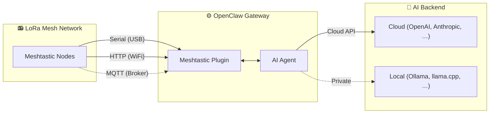

<p align="center">
  
</p>
<h1 align="center">MeshClaw</h1>
<p align="center"><b>メッシュに AI を — インターネット不要</b></p>

<p align="center">
  <a href="https://www.npmjs.com/package/@seeed-studio/meshtastic">
    
  </a>
  <a href="https://www.npmjs.com/package/@seeed-studio/meshtastic">
    
  </a>
  <a href="https://github.com/Seeed-Solution/MeshClaw/stargazers">
    
  </a>
  <a href="https://github.com/Seeed-Solution/MeshClaw/commits/main">
    
  </a>
  <a href="https://github.com/openclaw/openclaw">
    
  </a>
</p>
<!-- LANG_SWITCHER_START -->
<p align="center">
  <a href="README.md">English</a> | <a href="README.zh-CN.md">中文</a> | <b>日本語</b> | <a href="README.fr.md">Français</a> | <a href="README.pt.md">Português</a> | <a href="README.es.md">Español</a>
</p>
<!-- LANG_SWITCHER_END -->

**MeshClaw** は、[OpenClaw](https://github.com/openclaw/openclaw) のチャンネルプラグインで、AI Agent と [Meshtastic](https://meshtastic.org/) の LoRa メッシュネットワークを橋渡しします。電波経由で AI 駆動のメッセージを送受信できます — 山中、外洋、あるいはインフラの届かない場所でも動作します。



[ドキュメント][docs] · [ハードウェアガイド](#推奨ハードウェア) · [バグ報告][issues] · [機能提案][issues]

## 目次

- [機能](#機能)
- [クイックスタート](#クイックスタート)
- [ユースケース](#ユースケース)
- [デモ](#デモ)
- [推奨ハードウェア](#推奨ハードウェア)
- [セットアップウィザード](#セットアップウィザード)
- [設定](#1-トランスポート)
- [トラブルシューティング](#2-lora-リージョン)
- [ロードマップ](#3-ノード名)
- [開発](#4-チャンネルアクセス-grouppolicy)
- [貢献方法](#5-mention-必須)

## 機能

- **AI Agent 連携** — OpenClaw の AI Agent と Meshtastic の LoRa メッシュネットワークをつなぎます。クラウド AI はそのまま使えます。完全ローカル運用も可能です（[ハードウェア](#推奨ハードウェア) を参照）。
- **DM とグループチャンネルのアクセス制御** — DM の許可リスト、チャンネル応答ルール、@mention ゲーティングに対応します。
- **マルチアカウント対応** — 複数の独立した接続を同時に実行できます。
- **堅牢なメッシュ通信** — 再接続とリトライを設定可能です。切断時も安全に復旧します。

## クイックスタート

前提条件: 稼働中の [OpenClaw](https://github.com/openclaw/openclaw) インスタンス（Node.js 22+）。

```bash
# 1. Install plugin
openclaw plugins install @seeed-studio/meshtastic

# 2. Guided setup — walks you through transport, region, and access policy
openclaw onboard

# 3. Verify
openclaw channels status --probe
```

たった 3 コマンドで、AI がメッシュに参加します。

<p align="center">
  
</p>

## ユースケース

- **フィールドリサーチ** — 携帯電波圏外の現場から、研究者や調査チームが AI ナレッジベースに問い合わせます。
- **災害対応** — インフラ停止時でも、緊急対応チームに AI 補助の意思決定支援を提供します。
- **海事・航空** — 沖合や地上局から離れていても、船舶や航空機が AI との対話を維持します。
- **オフグリッドコミュニティ** — 僻地の集落でも、コミュニティメッシュネットワーク経由で AI ツールにアクセスできます。
- **プライバシー最優先の運用** — ローカル LLM と組み合わせ、データ主権が重要な現場でエアギャップ運用を実現します。
- **クロスチャンネルブリッジ** — オフグリッドな LoRa から送信し、AI の返信を Telegram、Discord、その他の OpenClaw チャンネルで受信できます。

## デモ

<div align="center">

https://github.com/user-attachments/assets/837062d9-a5bb-4e0a-b7cf-298e4bdf2f7c

</div>

Fallback: [media/demo.mp4](media/demo.mp4)

<p align="center">
  
  &nbsp;&nbsp;
  
</p>

<p align="center">
  <em>左: LoRa 経由でオフラインのまま AI に問い合わせ &nbsp;·&nbsp; 右: クロスチャンネルブリッジ — メッシュから送って Telegram で受信</em>
</p>

## 推奨ハードウェア

<p align="center">
  
</p>

| デバイス                       | 用途                               | リンク            |
| ----------------------------- | ---------------------------------- | ----------------- |
| XIAO ESP32S3 + Wio-SX1262 kit | エントリ向け開発                   | [購入][hw-xiao]   |
| Wio Tracker L1 Pro            | ポータブルなフィールドゲートウェイ | [購入][hw-wio]    |
| SenseCAP Card Tracker T1000-E | コンパクトなトラッカー             | [購入][hw-sensecap] |

> 任意: 完全オフラインの AI スタック — クラウド依存をゼロにしたい場合は、[reComputer J series][hw-recomputer] でローカル LLM（Ollama、llama.cpp など）を動かしてください。無線、ゲートウェイ、推論まで、すべてが自前のハードウェア上で完結します。API キーは不要で、データはネットワーク外に出ません。

ハードウェアがなくても大丈夫です。MQTT トランスポートなら broker 経由で接続でき、ローカルデバイスは不要です。

Meshtastic 互換デバイスなら何でも使えます。

## セットアップウィザード

`openclaw onboard` を実行すると、対話式ウィザードが起動し、順を追って設定できます。各ステップの意味と選び方を下記にまとめます。

### 1. トランスポート

ゲートウェイが Meshtastic メッシュに接続する方法です。

| オプション          | 説明                                                          | 必要なもの                                       |
| ------------------- | ------------------------------------------------------------- | ------------------------------------------------ |
| **Serial** (USB)    | ローカルデバイスに USB で直接接続します。利用可能なポートを自動検出します。 | Meshtastic デバイスを USB 接続                   |
| **HTTP** (WiFi)     | ローカルネットワーク越しにデバイスへ接続します。              | デバイスの IP またはホスト名（例: `meshtastic.local`） |
| **MQTT** (broker)   | MQTT broker 経由でメッシュに接続します。ローカルハードウェアは不要です。 | broker のアドレス、認証情報、購読トピック        |

### 2. LoRa リージョン

> Serial と HTTP のみ。MQTT は購読トピックからリージョンを導きます。

デバイスの無線周波数リージョンを設定します。各国の法規とメッシュ内の他ノードに合わせる必要があります。よく使う選択肢:

| 地域     | 周波数              |
| -------- | ------------------- |
| `US`     | 902–928 MHz         |
| `EU_868` | 869 MHz             |
| `CN`     | 470–510 MHz         |
| `JP`     | 920 MHz             |
| `UNSET`  | デバイス既定を維持  |

全一覧は [Meshtastic region docs](https://meshtastic.org/docs/getting-started/initial-config/#lora) を参照してください。

### 3. ノード名

メッシュ上でのデバイス表示名です。グループチャンネルでの「@mention トリガー」にも使われます。他のユーザーは `@OpenClaw` のように送ってボットに話しかけます。

- **Serial / HTTP**: 任意です。空のままなら接続されたデバイスから自動検出します。
- **MQTT**: 必須です。物理デバイスがないため名前を取得できません。

### 4. チャンネルアクセス (`groupPolicy`)

メッシュのグループチャンネル（例: LongFast、Emergency）でボットが返信するか、どのように返信するかを制御します。

| ポリシー             | 動作                                                          |
| -------------------- | ------------------------------------------------------------- |
| `disabled` (既定)    | すべてのグループチャンネルを無視します。DM のみ処理します。   |
| `open`               | メッシュ上の「すべての」チャンネルで返信します。              |
| `allowlist`          | 指定したチャンネルのみに返信します。プロンプトに従ってチャンネル名（カンマ区切り、例: `LongFast, Emergency`）を入力します。`*` はワイルドカードとして全一致に使えます。 |

### 5. @mention 必須

> チャンネルアクセスが有効（`disabled` 以外）のときのみ表示されます。

有効にすると（デフォルト: はい）、グループチャンネルでは誰かがノード名をメンションしたときだけボットが返信します（例: `@OpenClaw how's the weather?`）。これにより、チャンネル内のすべてのメッセージに反応するのを防ぎます。

無効にすると、許可されたチャンネル内の「すべて」のメッセージに返信します。

### 6. DM アクセスポリシー (`dmPolicy`)

ボットに **ダイレクトメッセージ** を送れる相手を制御します。

| ポリシー             | 動作                                                          |
| ------------------- | ------------------------------------------------------------- |
| `pairing` (既定)    | 新しい送信者はペアリング要求が発生し、許可されるまでチャットできません。 |
| `open`              | メッシュ上の誰でも自由に DM できます。                        |
| `allowlist`         | `allowFrom` に記載されたノードのみ DM を許可します。その他は無視します。 |

### 7. DM 許可リスト (`allowFrom`)

> `dmPolicy` が `allowlist` のとき、またはウィザードが必要と判断したときに表示されます。

DM を送信できる Meshtastic User ID のリストです。形式: `!aabbccdd`（16 進 User ID）。複数はカンマ区切りです。

<p align="center">
  
</p>

### 8. アカウント表示名

> マルチアカウント構成のときのみ表示されます。任意です。

各アカウントに読みやすい表示名を割り当てます。たとえば ID が `home` のアカウントに「Home Station」といった名前を付けられます。省略すると生のアカウント ID をそのまま使います。見た目だけの設定で、機能には影響しません。

## 設定

ガイド付きセットアップ（`openclaw onboard`）で以下の設定はすべてカバーします。手動で設定する場合は `openclaw config edit` で編集します。

### Serial (USB)

```yaml
channels:
  meshtastic:
    transport: serial
    serialPort: /dev/ttyUSB0
    nodeName: OpenClaw
```

### HTTP (WiFi)

```yaml
channels:
  meshtastic:
    transport: http
    httpAddress: meshtastic.local
    nodeName: OpenClaw
```

### MQTT (broker)

```yaml
channels:
  meshtastic:
    transport: mqtt
    nodeName: OpenClaw
    mqtt:
      broker: mqtt.meshtastic.org
      username: meshdev
      password: large4cats
      topic: "msh/US/2/json/#"
```

### マルチアカウント

```yaml
channels:
  meshtastic:
    accounts:
      home:
        transport: serial
        serialPort: /dev/ttyUSB0
      remote:
        transport: mqtt
        mqtt:
          broker: mqtt.meshtastic.org
          topic: "msh/US/2/json/#"
```

<details>
<summary><b>全オプションリファレンス</b></summary>

| キー                 | 型                              | 既定値                | 備考                                                          |
| ------------------- | ------------------------------- | --------------------- | ------------------------------------------------------------- |
| `transport`         | `serial \| http \| mqtt`        | `serial`              |                                                               |
| `serialPort`        | `string`                        | —                     | Serial で必須                                                 |
| `httpAddress`       | `string`                        | `meshtastic.local`    | HTTP で必須                                                   |
| `httpTls`           | `boolean`                       | `false`               |                                                               |
| `mqtt.broker`       | `string`                        | `mqtt.meshtastic.org` |                                                               |
| `mqtt.port`         | `number`                        | `1883`                |                                                               |
| `mqtt.username`     | `string`                        | `meshdev`             |                                                               |
| `mqtt.password`     | `string`                        | `large4cats`          |                                                               |
| `mqtt.topic`        | `string`                        | `msh/US/2/json/#`     | 購読トピック                                                  |
| `mqtt.publishTopic` | `string`                        | derived               |                                                               |
| `mqtt.tls`          | `boolean`                       | `false`               |                                                               |
| `region`            | enum                            | `UNSET`               | `US`, `EU_868`, `CN`, `JP`, `ANZ`, `KR`, `TW`, `RU`, `IN`, `NZ_865`, `TH`, `EU_433`, `UA_433`, `UA_868`, `MY_433`, `MY_919`, `SG_923`, `LORA_24`。Serial/HTTP のみ。 |
| `nodeName`          | `string`                        | auto-detect           | 表示名兼 @mention トリガー。MQTT では必須。                   |
| `dmPolicy`          | `open \| pairing \| allowlist`  | `pairing`             | 誰が DM を送れるか。詳しくは [DM アクセスポリシー](#6-dm-アクセスポリシー-dmpolicy)。 |
| `allowFrom`         | `string[]`                      | —                     | DM 許可リストのノード ID。例: `["!aabbccdd"]`                 |
| `groupPolicy`       | `open \| allowlist \| disabled` | `disabled`            | グループチャンネルでの応答ポリシー。詳しくは [チャンネルアクセス](#4-チャンネルアクセス-grouppolicy)。 |
| `channels`          | `Record<string, object>`        | —                     | チャンネル単位の上書き: `requireMention`, `allowFrom`, `tools` |

</details>

<details>
<summary><b>環境変数による上書き</b></summary>

これらは既定アカウントの設定を上書きします（名前付きアカウントでは YAML が優先されます）。

| 環境変数                 | 対応する設定キー     |
| ----------------------- | -------------------- |
| `MESHTASTIC_TRANSPORT`  | `transport`          |
| `MESHTASTIC_SERIAL_PORT`| `serialPort`         |
| `MESHTASTIC_HTTP_ADDRESS` | `httpAddress`       |
| `MESHTASTIC_MQTT_BROKER` | `mqtt.broker`       |
| `MESHTASTIC_MQTT_TOPIC` | `mqtt.topic`         |

</details>

## トラブルシューティング

| 症状                  | 確認事項                                                     |
| --------------------- | ------------------------------------------------------------ |
| Serial に接続できない | デバイスパスは正しいですか？ホストにアクセス権がありますか？ |
| HTTP に接続できない   | `httpAddress` に到達できますか？`httpTls` はデバイス設定と一致していますか？ |
| MQTT を受信しない     | `mqtt.topic` のリージョンは正しいですか？broker の認証情報は有効ですか？ |
| DM に返信がない       | `dmPolicy` と `allowFrom` は設定済みですか？[DM アクセスポリシー](#6-dm-アクセスポリシー-dmpolicy) を参照してください。 |
| グループで返信がない  | `groupPolicy` は有効ですか？許可リストにチャンネルがありますか？@mention が必須では？[チャンネルアクセス](#4-チャンネルアクセス-grouppolicy) を参照してください。 |

バグを見つけましたか？トランスポート種別、設定（秘密情報は除く）、そして `openclaw channels status --probe` の出力を添えて [issue][issues] を作成してください。

## ロードマップ

リアルタイムのノードデータ（GPS 位置、環境センサー、デバイス状態）を OpenClaw のコンテキストに取り込み、ユーザーの問い合わせを待たずに AI がメッシュネットワークの健全性を監視し、能動的にアラートを配信できるようにする計画です。

## 開発

```bash
git clone https://github.com/Seeed-Solution/MeshClaw.git
cd MeshClaw
npm install
openclaw plugins install -l ./MeshClaw
```

ビルド手順は不要です — OpenClaw が TypeScript のソースを直接読み込みます。`openclaw channels status --probe` で確認してください。

## 貢献方法

あらゆる形の貢献を歓迎します。

- **バグ報告・機能要望** — [issue を作成][issues]
- **コード貢献** — リポジトリを fork し、ブランチを切って PR を送ってください。既存の TypeScript のコーディング規約に合わせてください。
- **ドキュメント・翻訳** — ドキュメントの改善や新しい言語の追加も大歓迎です。

ローカル環境のセットアップは [開発](#開発) を参照してください。

---

MeshClaw が役立ったと感じたら、スター ⭐ をお願いします。プロジェクトを見つけてもらいやすくなります。

<!-- Reference-style links -->
[docs]: https://meshtastic.org/docs/
[issues]: https://github.com/Seeed-Solution/MeshClaw/issues
[hw-xiao]: https://www.seeedstudio.com/Wio-SX1262-with-XIAO-ESP32S3-p-5982.html
[hw-wio]: https://www.seeedstudio.com/Wio-Tracker-L1-Pro-p-6454.html
[hw-sensecap]: https://www.seeedstudio.com/SenseCAP-Card-Tracker-T1000-E-for-Meshtastic-p-5913.html
[hw-recomputer]: https://www.seeedstudio.com/reComputer-J4012-p-5586.html