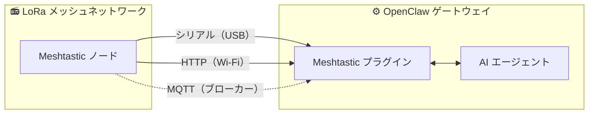

<think>**Translating README to Japanese**

I need to translate the README markdown into Japanese while retaining the original markdown features like code blocks, tables, links, and badges. The language switcher should be updated to bold Japanese while keeping links to other languages. The original has LANG_SWITCHER_START indicating a switch for languages like English, and I'll maintain those links while adjusting the Japanese part to be prominently bolded. It's important to keep all formatting intact as I work on this translation.**Translating content for clarity**

I need to translate text, headings, and table column names, while keeping code blocks unchanged. For a Japanese audience, I should translate comments in those code blocks, especially those starting with #. The instruction is clear: I have to translate the README markdown to Japanese, so I’ll translate inline comments too. Additionally, image alt text needs translation, such as “Meshtastic LoRa hardware” to “Meshtastic LoRa ハードウェア.” I’ll ensure safe region text remains unchanged for readability.**Adapting link anchors for Japanese**

I need to adapt the link anchors to match Japanese slugs when translating headings. The current Table of Contents (TOC) links to English IDs like #how-it-works, but GitHub will generate new anchors based on the Japanese text. Within the document, I should adjust the TOC links to align with the new anchors. It's recommended to keep the English anchors but they won’t work as intended. I may need to replace links with local anchors from the Japanese headings, considering how GitHub generates these slugs.**Clarifying anchor generation for Markdown**

GitHub generates anchors by removing non-alphanumeric characters, and they utilize percent encoding for non-Latin characters. Writing something like [仕組み](#how-it-works) won't work as intended. One option is to keep the English headings in parentheses to maintain the same ID. Another approach is to preserve the original English headings alongside the Japanese text. 

However, I think the best solution is to insert HTML anchors like <a id="how-it-works"></a> before each section, so the TOC links will work correctly. I’ll apply this to all relevant headings and subheadings!**Translating capabilities and roadmap**

I’m working on translating the capabilities and roadmap content into Japanese. This includes several parts like the treatment of channels, AI conversations, and details in tables like the Offline Query and Cross-Channel Bridge. The Quick Start and Setup Wizard sections also need translation, especially comments in code blocks. 

For example, I’ll translate terms like "Serial (USB)" and include Japanese for any necessary options. I'll make sure to translate policies and troubleshoot instructions clearly. Plus, the alt texts in badges will be updated to maintain consistency. Let’s get the full translated markdown ready!</think>

<p align="center">
  
</p>

# MeshClaw: OpenClaw Meshtastic チャンネルプラグイン

<p align="center">
  <a href="https://www.npmjs.com/package/@seeed-studio/meshtastic">
    
  </a>
  <a href="https://www.npmjs.com/package/@seeed-studio/meshtastic">
    
  </a>
</p>

<!-- LANG_SWITCHER_START -->
<p align="center">
  <a href="README.md">English</a> | <a href="README.zh-CN.md">中文</a> | <b>日本語</b> | <a href="README.fr.md">Français</a> | <a href="README.pt.md">Português</a> | <a href="README.es.md">Español</a>
</p>
<!-- LANG_SWITCHER_END -->

MeshClaw は、OpenClaw のチャンネル用プラグインで、あなたの AI ゲートウェイが Meshtastic 経由でメッセージを送受信できるようにします。インターネットも携帯基地局も不要、使うのは電波だけ。山でも海でも、電力網の届かない場所でも AI アシスタントと会話できます。

⭐ GitHub でスターをお願いします — 大きな励みになります！

> [!IMPORTANT]
> これは [OpenClaw](https://github.com/openclaw/openclaw) AI ゲートウェイ向けのチャンネルプラグインです。単体アプリではありません。使用には OpenClaw の稼働インスタンス（Node.js 22 以上）が必要です。

[ドキュメント][docs] · [推奨ハードウェア](#recommended-hardware) · [不具合報告][issues] · [機能要望][issues]

## 目次

- [仕組み](#how-it-works)
- [推奨ハードウェア](#recommended-hardware)
- [機能](#features)
- [機能とロードマップ](#capabilities--roadmap)
- [デモ](#demo)
- [クイックスタート](#quick-start)
- [セットアップウィザード](#setup-wizard)
- [設定](#configuration)
- [トラブルシューティング](#troubleshooting)
- [開発](#development)
- [コントリビュート](#contributing)

<a id="how-it-works"></a>
## 仕組み



このプラグインは、Meshtastic LoRa デバイスと OpenClaw の AI エージェントを橋渡しします。3 つのトランスポートモードに対応しています。

- シリアル — ローカルの Meshtastic デバイスに USB 直結
- HTTP — Wi‑Fi/ローカルネットワーク越しにデバイスへ接続
- MQTT — Meshtastic の MQTT ブローカーを購読。ローカルハードウェア不要

受信メッセージは、AI に渡る前にアクセス制御（DM ポリシー、グループポリシー、メンション必須）を通過します。送信返信は LoRa デバイスで表示できない Markdown 装飾を除去し、電波パケットサイズ制限に収まるよう分割します。

<a id="recommended-hardware"></a>
## 推奨ハードウェア

<p align="center">
  
</p>

| デバイス                       | 用途                         | リンク           |
| ----------------------------- | ---------------------------- | ---------------- |
| XIAO ESP32S3 + Wio-SX1262 キット | 入門・エントリー開発           | [購入][hw-xiao]  |
| Wio Tracker L1 Pro            | 現場向け携帯ゲートウェイ         | [購入][hw-wio]   |
| SenseCAP Card Tracker T1000-E | 小型トラッカー                 | [購入][hw-sensecap] |

ハードウェアがなくても問題ありません。MQTT トランスポートならブローカー経由で接続でき、ローカルデバイスは不要です。

Meshtastic 互換デバイスであればどれでも動作します。

<a id="features"></a>
## 機能

- AI エージェント統合 — OpenClaw の AI エージェントと Meshtastic の LoRa メッシュネットワークを橋渡し。クラウドに依存しないインテリジェント通信を実現。

- 3 種のトランスポート — シリアル（USB）、HTTP（Wi‑Fi）、MQTT に対応

- DM とグループチャネルのアクセス制御 — DM 許可リスト、チャネルごとの応答ルール、メンション必須のゲーティングに対応

- マルチアカウント対応 — 複数の独立接続を同時に運用可能

- タフなメッシュ通信 — 再接続とリトライ回数を設定可能。接続断を堅牢に処理

<a id="capabilities--roadmap"></a>
## 機能とロードマップ

このプラグインは Meshtastic を Telegram や Discord と同格の「一級チャンネル」として扱い、インターネットに依存せず LoRa 電波だけで AI との会話やスキル呼び出しを可能にします。

| オフラインで情報を問い合わせる                                  | クロスチャネルブリッジ：オフグリッドから送信して、どこでも受信 | 🔜 次に予定していること                                       |
| -------------------------------------------------------------- | ---------------------------------------------------------- | ------------------------------------------------------------ |
|  |   | ノードのリアルタイムデータ（GPS 位置、環境センサー、デバイス状態）を OpenClaw のコンテキストに取り込み、AI がメッシュの健全性を監視し、ユーザーの問い合わせを待たずに能動的なアラートをブロードキャストできるようにする予定です。 |

<a id="demo"></a>
## デモ

<div align="center">

https://github.com/user-attachments/assets/837062d9-a5bb-4e0a-b7cf-298e4bdf2f7c

</div>

代替: [media/demo.mp4](media/demo.mp4)

<a id="quick-start"></a>
## クイックスタート

```bash
# 1. プラグインをインストール
openclaw plugins install @seeed-studio/meshtastic

# 2. ガイド付きセットアップ — トランスポート、地域、アクセス方針を対話設定
openclaw onboard

# 3. 動作確認
openclaw channels status --probe
```

<p align="center">
  
</p>

<a id="setup-wizard"></a>
## セットアップウィザード

`openclaw onboard` を実行すると、各設定ステップを案内する対話式ウィザードが起動します。以下に各ステップの意味と選び方をまとめます。

### 1. トランスポート

ゲートウェイが Meshtastic メッシュに接続する方法：

| オプション           | 説明                                                          | 必要なもの                                            |
| -------------------- | ------------------------------------------------------------- | ----------------------------------------------------- |
| シリアル（USB）      | ローカルデバイスに USB 直結。利用可能なポートを自動検出します。 | USB 接続された Meshtastic デバイス                    |
| HTTP（Wi‑Fi）        | ローカルネットワーク越しにデバイスへ接続します。              | デバイスの IP またはホスト名（例: `meshtastic.local`） |
| MQTT（ブローカー）   | MQTT ブローカー経由でメッシュに接続。ローカルハード不要。     | ブローカーのアドレス、認証情報、購読トピック          |

### 2. LoRa リージョン

> シリアルと HTTP のみ。MQTT は購読トピックからリージョンを推定します。

デバイスの無線周波数リージョンを設定します。地域の法規制およびメッシュ上の他ノードと一致させる必要があります。代表的な選択肢：

| リージョン | 周波数帯            |
| ---------- | ------------------- |
| `US`       | 902–928 MHz         |
| `EU_868`   | 869 MHz             |
| `CN`       | 470–510 MHz         |
| `JP`       | 920 MHz             |
| `UNSET`    | デバイスの既定値を維持 |

完全な一覧は Meshtastic のリージョンドキュメント（https://meshtastic.org/docs/getting-started/initial-config/#lora）を参照してください。

### 3. ノード名

メッシュ上でのデバイス表示名。グループチャネルでは @メンションのトリガーにも使用されます。例えば他ユーザーは `@OpenClaw` と送ってボットに話しかけます。

- シリアル / HTTP: 任意 — 空のままなら接続デバイスから自動取得します。
- MQTT: 必須 — 物理デバイスがないため名前を読み取れません。

<a id="4-channel-access-grouppolicy"></a>
### 4. チャネルアクセス（`groupPolicy`）

メッシュのグループチャネル（例: LongFast、Emergency）でボットがどのように応答するかを制御します：

| ポリシー               | 動作                                                         |
| ---------------------- | ------------------------------------------------------------ |
| `disabled`（既定）     | すべてのグループチャネルを無視。DM のみ処理します。          |
| `open`                 | メッシュ上のあらゆるチャネルで応答します。                   |
| `allowlist`            | 指定したチャネルでのみ応答します。チャネル名の入力を促されます（カンマ区切り。例: `LongFast, Emergency`）。ワイルドカード `*` で全てに一致させられます。 |

### 5. メンション必須

> チャネルアクセスが有効（`disabled` 以外）な場合のみ表示されます。

有効（既定は「はい」）にすると、グループチャネルでは誰かがノード名をメンションした場合のみボットが応答します（例: `@OpenClaw 天気は？`）。これにより、チャネル内の全メッセージに返信してしまうことを防げます。

無効にすると、許可されたチャネル内のすべてのメッセージに応答します。

<a id="6-dm-access-policy-dmpolicy"></a>
### 6. DM アクセスポリシー（`dmPolicy`）

ボットに「ダイレクトメッセージ」を送信できる相手を制御します：

| ポリシー               | 動作                                                         |
| ---------------------- | ------------------------------------------------------------ |
| `pairing`（既定）      | 新規送信者はペアリング要求が発生し、承認後にチャット可能。    |
| `open`                 | メッシュ上の誰でも自由に DM 可能。                           |
| `allowlist`           | `allowFrom` に記載のノードのみ DM 可能。その他は無視。        |

### 7. DM 許可リスト（`allowFrom`）

> `dmPolicy` が `allowlist` の場合、またはウィザードが必要と判断した場合のみ表示されます。

ダイレクトメッセージ送信を許可する Meshtastic ユーザー ID の一覧。フォーマット: `!aabbccdd`（16 進 User ID）。複数はカンマ区切り。

<p align="center">
  
</p>

### 8. アカウント表示名

> マルチアカウント構成の場合のみ表示。任意。

各アカウントに人間が読みやすい表示名を割り当てます。例: ID `home` のアカウントに「Home Station」を表示。省略時は生のアカウント ID がそのまま使われます。機能には影響しない見た目だけの設定です。

<a id="configuration"></a>
## 設定

ガイド付きセットアップ（`openclaw onboard`）で以下の内容はすべて設定できます。手順は[セットアップウィザード](#setup-wizard)を参照してください。手動で設定する場合は `openclaw config edit` で編集します。

### シリアル（USB）

```yaml
channels:
  meshtastic:
    transport: serial
    serialPort: /dev/ttyUSB0
    nodeName: OpenClaw
```

### HTTP（Wi‑Fi）

```yaml
channels:
  meshtastic:
    transport: http
    httpAddress: meshtastic.local
    nodeName: OpenClaw
```

### MQTT（ブローカー）

```yaml
channels:
  meshtastic:
    transport: mqtt
    nodeName: OpenClaw
    mqtt:
      broker: mqtt.meshtastic.org
      username: meshdev
      password: large4cats
      topic: "msh/US/2/json/#"
```

### マルチアカウント

```yaml
channels:
  meshtastic:
    accounts:
      home:
        transport: serial
        serialPort: /dev/ttyUSB0
      remote:
        transport: mqtt
        mqtt:
          broker: mqtt.meshtastic.org
          topic: "msh/US/2/json/#"
```

<details>
<summary><b>すべてのオプション（リファレンス）</b></summary>

| キー                  | 型                               | 既定                  | 備考                                                        |
| --------------------- | -------------------------------- | --------------------- | ----------------------------------------------------------- |
| `transport`           | `serial \| http \| mqtt`         | `serial`              |                                                             |
| `serialPort`          | `string`                         | —                     | シリアルで必須                                              |
| `httpAddress`         | `string`                         | `meshtastic.local`    | HTTP で必須                                                 |
| `httpTls`             | `boolean`                        | `false`               |                                                             |
| `mqtt.broker`         | `string`                         | `mqtt.meshtastic.org` |                                                             |
| `mqtt.port`           | `number`                         | `1883`                |                                                             |
| `mqtt.username`       | `string`                         | `meshdev`             |                                                             |
| `mqtt.password`       | `string`                         | `large4cats`          |                                                             |
| `mqtt.topic`          | `string`                         | `msh/US/2/json/#`     | 購読トピック                                                |
| `mqtt.publishTopic`   | `string`                         | derived               |                                                             |
| `mqtt.tls`            | `boolean`                        | `false`               |                                                             |
| `region`              | enum                             | `UNSET`               | `US`, `EU_868`, `CN`, `JP`, `ANZ`, `KR`, `TW`, `RU`, `IN`, `NZ_865`, `TH`, `EU_433`, `UA_433`, `UA_868`, `MY_433`, `MY_919`, `SG_923`, `LORA_24`。シリアル/HTTP のみ。 |
| `nodeName`            | `string`                         | 自動検出              | 表示名かつ @メンションのトリガー。MQTT では必須。           |
| `dmPolicy`            | `open \| pairing \| allowlist`   | `pairing`             | DM 送信を許可する範囲。[DM アクセスポリシー](#6-dm-access-policy-dmpolicy)参照。 |
| `allowFrom`           | `string[]`                       | —                     | DM 許可リストのノード ID（例: `["!aabbccdd"]`）             |
| `groupPolicy`         | `open \| allowlist \| disabled`  | `disabled`            | グループチャネルでの応答ポリシー。[チャネルアクセス](#4-channel-access-grouppolicy)参照。 |
| `channels`            | `Record<string, object>`         | —                     | チャネルごとの上書き設定：`requireMention`、`allowFrom`、`tools` |

</details>

<details>
<summary><b>環境変数での上書き</b></summary>

これらは既定アカウントの設定を上書きします（名前付きアカウントについては YAML が優先されます）。

| 変数名                    | 同等の設定キー         |
| ------------------------ | ---------------------- |
| `MESHTASTIC_TRANSPORT`   | `transport`            |
| `MESHTASTIC_SERIAL_PORT` | `serialPort`           |
| `MESHTASTIC_HTTP_ADDRESS`| `httpAddress`          |
| `MESHTASTIC_MQTT_BROKER` | `mqtt.broker`          |
| `MESHTASTIC_MQTT_TOPIC`  | `mqtt.topic`           |

</details>

<a id="troubleshooting"></a>
## トラブルシューティング

| 症状                   | 確認事項                                                     |
| ---------------------- | ------------------------------------------------------------ |
| シリアルに接続できない | デバイスパスは正しいか？ホストに権限はあるか？               |
| HTTP に接続できない    | `httpAddress` に到達できるか？`httpTls` はデバイス設定と一致しているか？ |
| MQTT を受信しない      | `mqtt.topic` のリージョンは正しいか？ブローカーの認証は有効か？ |
| DM に応答しない        | `dmPolicy` と `allowFrom` は設定済みか？[DM アクセスポリシー](#6-dm-access-policy-dmpolicy)を参照。 |
| グループで返信しない   | `groupPolicy` は有効か？チャネルは許可リストにあるか？メンション必須ではないか？[チャネルアクセス](#4-channel-access-grouppolicy)を参照。 |

バグを見つけましたか？[Issue を作成][issues]し、トランスポート種別、設定（秘密情報は伏せる）、そして `openclaw channels status --probe` の出力を添付してください。

<a id="development"></a>
## 開発

```bash
git clone https://github.com/Seeed-Solution/MeshClaw.git
cd MeshClaw
npm install
openclaw plugins install -l ./MeshClaw
```

ビルド不要 — OpenClaw が TypeScript のソースを直接読み込みます。`openclaw channels status --probe` で確認できます。

<a id="contributing"></a>
## コントリビュート

- バグ報告や機能要望は[Issue を作成][issues]
- プルリク歓迎 — 既存の TypeScript の記法に合わせてください

<!-- 参照形式のリンク -->
[docs]: https://meshtastic.org/docs/
[issues]: https://github.com/Seeed-Solution/MeshClaw/issues
[hw-xiao]: https://www.seeedstudio.com/Wio-SX1262-with-XIAO-ESP32S3-p-5982.html
[hw-wio]: https://www.seeedstudio.com/Wio-Tracker-L1-Pro-p-6454.html
[hw-sensecap]: https://www.seeedstudio.com/SenseCAP-Card-Tracker-T1000-E-for-Meshtastic-p-5913.html