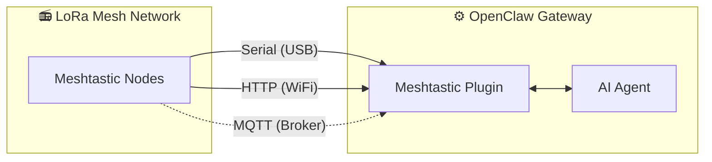

<p align="center">
  
</p>

# MeshClaw: Plugin de Canal Meshtastic para OpenClaw

<p align="center">
  <a href="https://www.npmjs.com/package/@seeed-studio/meshtastic">
    
  </a>
  <a href="https://www.npmjs.com/package/@seeed-studio/meshtastic">
    
  </a>
</p>

<!-- LANG_SWITCHER_START -->
<p align="center">
  <a href="README.md">English</a> | <a href="README.zh-CN.md">中文</a> | <a href="README.ja.md">日本語</a> | <a href="README.fr.md">Français</a> | <b>Português</b> | <a href="README.es.md">Español</a>
</p>
<!-- LANG_SWITCHER_END -->

O **MeshClaw** é um plugin de canal para o OpenClaw que permite ao seu gateway de IA enviar e receber mensagens via Meshtastic — sem internet, sem torres de celular, apenas ondas de rádio. Converse com seu assistente de IA das montanhas, do oceano ou de qualquer lugar fora da rede.

⭐ Dê uma star no GitHub — isso nos motiva muito!

> [!IMPORTANT]
> Este é um **plugin de canal** para o gateway de IA [OpenClaw](https://github.com/openclaw/openclaw) — não é um aplicativo independente. É necessário ter uma instância do OpenClaw em execução (Node.js 22+) para usá-lo.

[Documentação][docs] · [Guia de Hardware](#hardware-recomendado) · [Reportar Bug][issues] · [Solicitar Funcionalidade][issues]

## Índice

- [Como Funciona](#como-funciona)
- [Hardware Recomendado](#hardware-recomendado)
- [Funcionalidades](#funcionalidades)
- [Capacidades e Roadmap](#capacidades-e-roadmap)
- [Demonstração](#demonstração)
- [Início Rápido](#início-rápido)
- [Assistente de Configuração](#assistente-de-configuração)
- [Configuração](#configuração)
- [Solução de Problemas](#solução-de-problemas)
- [Desenvolvimento](#desenvolvimento)
- [Contribuição](#contribuição)

## Como Funciona



O plugin faz a ponte entre dispositivos Meshtastic LoRa e o AI Agent do OpenClaw. Ele suporta três modos de transporte:

- **Serial** — conexão USB direta a um dispositivo Meshtastic local
- **HTTP** — conecta a um dispositivo via WiFi / rede local
- **MQTT** — assina um broker MQTT Meshtastic, sem necessidade de hardware local

Mensagens recebidas passam pelo controle de acesso (política de DM, política de grupo, filtragem por @mention) antes de chegar à IA. Respostas enviadas têm a formatação markdown removida (dispositivos LoRa não conseguem renderizá-la) e são divididas em partes para caber nos limites de tamanho dos pacotes de rádio.

## Hardware Recomendado

<p align="center">
  
</p>

| Dispositivo                   | Ideal para              | Link               |
| ----------------------------- | ----------------------- | ------------------ |
| XIAO ESP32S3 + Wio-SX1262 kit | Desenvolvimento iniciante | [Buy][hw-xiao]     |
| Wio Tracker L1 Pro            | Gateway portátil de campo | [Buy][hw-wio]      |
| SenseCAP Card Tracker T1000-E | Rastreador compacto     | [Buy][hw-sensecap] |

Sem hardware? O transporte MQTT conecta via broker — não é necessário dispositivo local.

Qualquer dispositivo compatível com Meshtastic funciona.

## Funcionalidades

- **Integração com AI Agent** — Conecta AI Agents do OpenClaw a redes mesh Meshtastic LoRa. Permite comunicação inteligente sem dependência de nuvem.

- **Três Modos de Transporte** — Suporte a Serial (USB), HTTP (WiFi) e MQTT

- **Mensagens Diretas e Canais de Grupo com Controle de Acesso** — Suporta ambos os modos de conversa com listas de permissões para DM, regras de resposta em canais e filtragem por @mention

- **Suporte a Múltiplas Contas** — Execute múltiplas conexões independentes simultaneamente

- **Comunicação Mesh Resiliente** — Reconexão automática com tentativas configuráveis. Lida com quedas de conexão de forma elegante.

## Capacidades e Roadmap

O plugin trata o Meshtastic como um canal de primeira classe — assim como Telegram ou Discord — permitindo conversas com IA e invocação de skills inteiramente via rádio LoRa, sem dependência de internet.

| Consultar Informações Offline                                | Bridge Entre Canais: Envie fora da rede, receba em qualquer lugar | 🔜 O que vem por aí:                                         |
| ------------------------------------------------------------ | ---------------------------------------------------------- | ------------------------------------------------------------ |
|  |   | Planejamos incorporar dados de nós em tempo real (localização GPS, sensores ambientais, status do dispositivo) ao contexto do OpenClaw, permitindo que a IA monitore a saúde da rede mesh e transmita alertas proativos sem esperar por consultas do usuário. |

## Demonstração

<div align="center">

https://github.com/user-attachments/assets/837062d9-a5bb-4e0a-b7cf-298e4bdf2f7c

</div>

Alternativa: [media/demo.mp4](media/demo.mp4)

## Início Rápido

```bash
# 1. Instale o plugin
openclaw plugins install @seeed-studio/meshtastic

# 2. Configuração guiada — guia você pelo transporte, região e política de acesso
openclaw onboard

# 3. Verifique
openclaw channels status --probe
```

<p align="center">
  
</p>

## Assistente de Configuração

Executar `openclaw onboard` inicia um assistente interativo que guia você por cada etapa de configuração. Abaixo está o significado de cada etapa e como escolher.

### 1. Transporte

Como o gateway se conecta à rede mesh Meshtastic:

| Opção             | Descrição                                                  | Requer                                         |
| ----------------- | ------------------------------------------------------------ | ------------------------------------------------ |
| **Serial** (USB)  | Conexão USB direta a um dispositivo local. Detecta automaticamente portas disponíveis. | Dispositivo Meshtastic conectado via USB             |
| **HTTP** (WiFi)   | Conecta a um dispositivo via rede local.                 | IP do dispositivo ou hostname (ex: `meshtastic.local`)  |
| **MQTT** (broker) | Conecta à rede mesh via um broker MQTT — sem necessidade de hardware local. | Endereço do broker, credenciais e tópico de assinatura |

### 2. Região LoRa

> Apenas Serial e HTTP. O MQTT deriva a região do tópico de assinatura.

Define a região de frequência de rádio no dispositivo. Deve corresponder às regulamentações locais e aos outros nós da rede. Escolhas comuns:

| Região   | Frequência           |
| -------- | ------------------- |
| `US`     | 902–928 MHz         |
| `EU_868` | 869 MHz             |
| `CN`     | 470–510 MHz         |
| `JP`     | 920 MHz             |
| `UNSET`  | Manter padrão do dispositivo |

Veja a [documentação de regiões do Meshtastic](https://meshtastic.org/docs/getting-started/initial-config/#lora) para a lista completa.

### 3. Nome do Nó

O nome de exibição do dispositivo na rede. Também usado como **gatilho de @mention** em canais de grupo — outros usuários enviam `@OpenClaw` para falar com seu bot.

- **Serial / HTTP**: opcional — detecta automaticamente do dispositivo conectado se deixado em branco.
- **MQTT**: obrigatório — não há dispositivo físico para ler o nome.

### 4. Acesso a Canais (`groupPolicy`)

Controla se e como o bot responde em **canais de grupo mesh** (ex: LongFast, Emergency):

| Política             | Comportamento                                                     |
| -------------------- | ------------------------------------------------------------ |
| `disabled` (padrão) | Ignora todas as mensagens de canais de grupo. Apenas mensagens diretas são processadas.  |
| `open`               | Responde em **todos** os canais da rede.                   |
| `allowlist`          | Responde apenas em canais **listados**. Você será solicitado a inserir nomes de canais (separados por vírgula, ex: `LongFast, Emergency`). Use `*` como coringa para corresponder a todos. |

### 5. Requerer Mention

> Aparece apenas quando o acesso a canais está habilitado (não `disabled`).

Quando habilitado (padrão: **sim**), o bot só responde em canais de grupo quando alguém menciona seu nome de nó (ex: `@OpenClaw como está o tempo?`). Isso impede que o bot responda a cada mensagem do canal.

Quando desabilitado, o bot responde a **todas** as mensagens nos canais permitidos.

### 6. Política de Acesso a DM (`dmPolicy`)

Controla quem pode enviar **mensagens diretas** ao bot:

| Política              | Comportamento                                                     |
| ------------------- | ------------------------------------------------------------ |
| `pairing` (padrão) | Novos remetentes acionam uma solicitação de pareamento que deve ser aprovada antes de poderem conversar. |
| `open`              | Qualquer pessoa na rede pode enviar DM ao bot livremente.                    |
| `allowlist`         | Apenas nós listados em `allowFrom` podem enviar DM. Todos os outros são ignorados. |

### 7. Lista de Permissões de DM (`allowFrom`)

> Aparece apenas quando `dmPolicy` é `allowlist`, ou quando o assistente determina que uma é necessária.

Uma lista de IDs de Usuário Meshtastic permitidos a enviar mensagens diretas. Formato: `!aabbccdd` (ID de Usuário hex). Múltiplas entradas são separadas por vírgula.

<p align="center">
  
</p>

### 8. Nomes de Exibição de Conta

> Aparece apenas para configurações multi-conta. Opcional.

Atribui nomes de exibição legíveis às suas contas. Por exemplo, uma conta com ID `home` pode ser exibida como "Home Station". Se ignorado, o ID bruto da conta é usado como está. Isso é puramente cosmético e não afeta a funcionalidade.

## Configuração

A configuração guiada (`openclaw onboard`) cobre tudo abaixo. Veja [Assistente de Configuração](#assistente-de-configuração) para um passo a passo detalhado. Para configuração manual, edite com `openclaw config edit`.

### Serial (USB)

```yaml
channels:
  meshtastic:
    transport: serial
    serialPort: /dev/ttyUSB0
    nodeName: OpenClaw
```

### HTTP (WiFi)

```yaml
channels:
  meshtastic:
    transport: http
    httpAddress: meshtastic.local
    nodeName: OpenClaw
```

### MQTT (broker)

```yaml
channels:
  meshtastic:
    transport: mqtt
    nodeName: OpenClaw
    mqtt:
      broker: mqtt.meshtastic.org
      username: meshdev
      password: large4cats
      topic: "msh/US/2/json/#"
```

### Multi-conta

```yaml
channels:
  meshtastic:
    accounts:
      home:
        transport: serial
        serialPort: /dev/ttyUSB0
      remote:
        transport: mqtt
        mqtt:
          broker: mqtt.meshtastic.org
          topic: "msh/US/2/json/#"
```

<details>
<summary><b>Referência de Todas as Opções</b></summary>

| Chave                 | Tipo                            | Padrão               | Notas                                                        |
| ------------------- | ------------------------------- | --------------------- | ------------------------------------------------------------ |
| `transport`         | `serial \| http \| mqtt`        | `serial`              |                                                              |
| `serialPort`        | `string`                        | —                     | Obrigatório para serial                                          |
| `httpAddress`       | `string`                        | `meshtastic.local`    | Obrigatório para HTTP                                            |
| `httpTls`           | `boolean`                       | `false`               |                                                              |
| `mqtt.broker`       | `string`                        | `mqtt.meshtastic.org` |                                                              |
| `mqtt.port`         | `number`                        | `1883`                |                                                              |
| `mqtt.username`     | `string`                        | `meshdev`             |                                                              |
| `mqtt.password`     | `string`                        | `large4cats`          |                                                              |
| `mqtt.topic`        | `string`                        | `msh/US/2/json/#`     | Tópico de assinatura                                              |
| `mqtt.publishTopic` | `string`                        | derived               |                                                              |
| `mqtt.tls`          | `boolean`                       | `false`               |                                                              |
| `region`            | enum                            | `UNSET`               | `US`, `EU_868`, `CN`, `JP`, `ANZ`, `KR`, `TW`, `RU`, `IN`, `NZ_865`, `TH`, `EU_433`, `UA_433`, `UA_868`, `MY_433`, `MY_919`, `SG_923`, `LORA_24`. Serial/HTTP only. |
| `nodeName`          | `string`                        | auto-detect           | Nome de exibição e gatilho de @mention. Obrigatório para MQTT.        |
| `dmPolicy`          | `open \| pairing \| allowlist`  | `pairing`             | Quem pode enviar mensagens diretas. Veja [Política de Acesso a DM](#6-política-de-acesso-a-dm-dmpolicy). |
| `allowFrom`         | `string[]`                      | —                     | IDs de nó para lista de permissões de DM, ex: `["!aabbccdd"]`              |
| `groupPolicy`       | `open \| allowlist \| disabled` | `disabled`            | Política de resposta em canais de grupo. Veja [Acesso a Canais](#4-acesso-a-canais-grouppolicy). |
| `channels`          | `Record<string, object>`        | —                     | Substituições por canal: `requireMention`, `allowFrom`, `tools` |

</details>

<details>
<summary><b>Substituições por Variáveis de Ambiente</b></summary>

Estas substituem a configuração da conta padrão (YAML tem precedência para contas nomeadas):

| Variável                  | Chave de configuração equivalente |
| ------------------------- | --------------------- |
| `MESHTASTIC_TRANSPORT`    | `transport`           |
| `MESHTASTIC_SERIAL_PORT`  | `serialPort`          |
| `MESHTASTIC_HTTP_ADDRESS` | `httpAddress`         |
| `MESHTASTIC_MQTT_BROKER`  | `mqtt.broker`         |
| `MESHTASTIC_MQTT_TOPIC`   | `mqtt.topic`          |

</details>

## Solução de Problemas

| Sintoma               | Verifique                                                        |
| --------------------- | ------------------------------------------------------------ |
| Serial não conecta  | Caminho do dispositivo correto? Host tem permissão?                    |
| HTTP não conecta    | `httpAddress` acessível? `httpTls` corresponde ao dispositivo?           |
| MQTT não recebe nada | Região em `mqtt.topic` correta? Credenciais do broker válidas?    |
| Sem respostas de DM       | `dmPolicy` e `allowFrom` configurados? Veja [Política de Acesso a DM](#6-política-de-acesso-a-dm-dmpolicy). |
| Sem respostas em grupo      | `groupPolicy` habilitado? Canal na lista de permissões? Mention necessária? Veja [Acesso a Canais](#4-acesso-a-canais-grouppolicy). |

Encontrou um bug? [Abra uma issue][issues] com o tipo de transporte, configuração (remova segredos) e saída do `openclaw channels status --probe`.

## Desenvolvimento

```bash
git clone https://github.com/Seeed-Solution/openclaw-meshtastic.git
cd openclaw-meshtastic
npm install
openclaw plugins install -l ./openclaw-meshtastic
```

Sem etapa de build — o OpenClaw carrega o código fonte TypeScript diretamente. Use `openclaw channels status --probe` para verificar.

## Contribuição

- [Abra uma issue][issues] para bugs ou solicitações de funcionalidades
- Pull Requests são bem-vindos — mantenha o código alinhado com as convenções TypeScript existentes

<!-- Reference-style links -->
[docs]: https://meshtastic.org/docs/
[issues]: https://github.com/Seeed-Solution/openclaw-meshtastic/issues
[hw-xiao]: https://www.seeedstudio.com/Wio-SX1262-with-XIAO-ESP32S3-p-5982.html
[hw-wio]: https://www.seeedstudio.com/Wio-Tracker-L1-Pro-p-6454.html
[hw-sensecap]: https://www.seeedstudio.com/SenseCAP-Card-Tracker-T1000-E-for-Meshtastic-p-5913.html