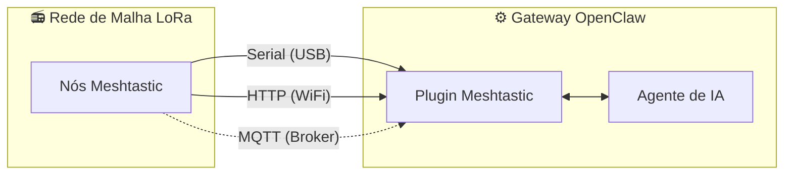

<think>**Translating README to Portuguese**

I need to translate the provided README Markdown into Portuguese while keeping the structure intact, including HTML tags, markdown headings, and tables. The instruction indicates they want the translation of the content itself. There’s a language switcher with links to different languages that I possibly need to adjust. It seems sensible to bold "Português" in the new version while ensuring the other language links remain clickable and in their original language.**Translating README considerations**

The instruction is to translate the README markdown to Portuguese, which doesn't imply creating a new version file. I need to keep the language switcher intact with "Português" bold, linking to the README filenames. The existing version links to README.pt.md for Portuguese, so I’ll make sure to format it correctly. While I should translate terms like "English" into Portuguese, it might be safer to just translate the text content while keeping the language switcher unchanged, even though many projects use their own language for names. All headings and text will be translated, and I’ll maintain disclaimers and warnings.**Updating README translation details**

I need to keep the code blocks unchanged but translate comments. For tables, I’ll translate column headers and content while leaving code keys, like region codes, intact. Any links referencing anchors (like #how-it-works) need updating to their Portuguese equivalents. Markdown anchors will be based on the heading text, but since GitHub’s auto anchors are in English, I’ll adjust them. For example, the heading “Como Funciona” will become #como-funciona. I’ll ensure anchors match the translations, like changing [Hardware Guide](#recommended-hardware) to (#hardware-recomendado) for consistency.**Translating documentation elements**

I need to label "Documentation [docs]" as "Documentação" and translate "Report Bug" and "Request Feature" into Portuguese. The tables, such as "Features," also need translation. I believe that the text in the Mermaid diagram, including labels like "LoRa Mesh Network" and "AI Agent," should be localized. 

For "Fallback: [media/demo.mp4]," I'll translate it to "Alternativa:." "Quick Start" becomes "Início Rápido," and I'll translate steps in the code blocks, such as "# 1. Install plugin," to Portuguese. "Setup Wizard" translates to "Assistente de Configuração," and "Require Mention" to "Exigir menção."

As for "DM," I think it's best to keep it as is but clarify it as "mensagens diretas (DM)" since the audience likely understands it. Finally, "allowlist" will be translated as "lista de permissões."**Translating README elements**

I’ll take care to translate specific elements like “Account Display Names” and “Configuration,” while examples like “Multi-account” will remain as they are. I’ll translate enumerations without altering region names and keep items like “Serial/HTTP only” as “Somente Serial/HTTP.” 

For other sections, headers, and descriptions in tables will be translated, while commands and development elements will stay unchanged. The language switcher will remain as is to avoid confusing links, even though we could translate visible names. I’ll highlight Portuguese in the content while keeping the top headings consistent, like changing "# MeshClaw: OpenClaw Meshtastic Channel Plugin" to "Plugin de Canal Meshtastic do OpenClaw." Finally, I’ll ensure that important notes are translated appropriately, and I’m ready to produce the final markdown translation!</think>

<p align="center">
  
</p>

# MeshClaw: Plugin de Canal Meshtastic do OpenClaw

<p align="center">
  <a href="https://www.npmjs.com/package/@seeed-studio/meshtastic">
    
  </a>
  <a href="https://www.npmjs.com/package/@seeed-studio/meshtastic">
    
  </a>
</p>

<!-- LANG_SWITCHER_START -->
<p align="center">
  <a href="README.md">English</a> | <a href="README.zh-CN.md">中文</a> | <a href="README.ja.md">日本語</a> | <a href="README.fr.md">Français</a> | <b>Português</b> | <a href="README.es.md">Español</a>
</p>
<!-- LANG_SWITCHER_END -->

O MeshClaw é um plugin de canal do OpenClaw que permite ao seu gateway de IA enviar e receber mensagens via Meshtastic — sem internet, sem torres de celular, apenas ondas de rádio. Converse com seu assistente de IA das montanhas, do mar ou de qualquer lugar fora da rede.

⭐ Dê uma estrela no GitHub — isso nos motiva muito!

> [!IMPORTANT]
> Este é um plugin de canal para o gateway de IA [OpenClaw](https://github.com/openclaw/openclaw) — não é um aplicativo independente. Você precisa de uma instância do OpenClaw em execução (Node.js 22+) para usá-lo.

[Documentação][docs] · [Guia de Hardware](#hardware-recomendado) · [Reportar Bug][issues] · [Sugerir Recurso][issues]

## Sumário

- [Como Funciona](#como-funciona)
- [Hardware Recomendado](#hardware-recomendado)
- [Recursos](#recursos)
- [Capacidades e Roadmap](#capacidades-e-roadmap)
- [Demo](#demo)
- [Início Rápido](#inicio-rapido)
- [Assistente de Configuração](#assistente-de-configuracao)
- [Configuração](#configuracao)
- [Solução de Problemas](#solucao-de-problemas)
- [Desenvolvimento](#desenvolvimento)
- [Contribuindo](#contribuindo)

## Como Funciona



O plugin faz a ponte entre dispositivos LoRa Meshtastic e o agente de IA do OpenClaw. Ele suporta três modos de transporte:

- Serial — conexão USB direta a um dispositivo Meshtastic local
- HTTP — conecta-se a um dispositivo via Wi‑Fi / rede local
- MQTT — assina um broker MQTT Meshtastic, sem necessidade de hardware local

Mensagens de entrada passam por controle de acesso (política de DM, política de grupo, exigência de menção) antes de chegar à IA. Respostas de saída têm a formatação Markdown removida (dispositivos LoRa não a renderizam) e são fragmentadas para caber nos limites de tamanho de pacotes de rádio.

## Hardware Recomendado

<p align="center">
  
</p>

| Dispositivo                    | Melhor para               | Link            |
| ----------------------------- | ------------------------- | --------------- |
| XIAO ESP32S3 + kit Wio-SX1262 | Desenvolvimento inicial   | [Comprar][hw-xiao]     |
| Wio Tracker L1 Pro            | Gateway de campo portátil | [Comprar][hw-wio]      |
| SenseCAP Card Tracker T1000-E | Rastreador compacto       | [Comprar][hw-sensecap] |

Sem hardware? O transporte MQTT conecta-se via broker — nenhum dispositivo local é necessário.

Qualquer dispositivo compatível com Meshtastic funciona.

## Recursos

- Integração com Agente de IA — Faz a ponte entre agentes de IA do OpenClaw e redes de malha LoRa Meshtastic. Possibilita comunicação inteligente sem depender da nuvem.

- Três Modos de Transporte — Suporte a Serial (USB), HTTP (Wi‑Fi) e MQTT

- Canais de DM e Grupo com Controle de Acesso — Suporta ambos os modos de conversa com listas de permissão para DMs, regras de resposta por canal e exigência de menção

- Suporte a Múltiplas Contas — Execute várias conexões independentes simultaneamente

- Comunicação de Malha Resiliente — Reconexão automática com tentativas configuráveis. Lida com quedas de conexão de forma elegante.

## Capacidades e Roadmap

O plugin trata o Meshtastic como um canal de primeira classe — assim como Telegram ou Discord — permitindo conversas com IA e invocação de habilidades inteiramente via rádio LoRa, sem depender de internet.

| Consultar Informações Offline                              | Ponte entre Canais: envie fora da rede, receba em qualquer lugar | 🔜 Próximos passos:                                           |
| ---------------------------------------------------------- | --------------------------------------------------------------- | ------------------------------------------------------------ |
|  |          | Planejamos ingerir dados em tempo real dos nós (localização GPS, sensores ambientais, status do dispositivo) no contexto do OpenClaw, permitindo que a IA monitore a saúde da rede de malha e transmita alertas proativos sem esperar por consultas dos usuários. |

## Demo

<div align="center">

https://github.com/user-attachments/assets/837062d9-a5bb-4e0a-b7cf-298e4bdf2f7c

</div>

Alternativa: [media/demo.mp4](media/demo.mp4)

## Início Rápido

```bash
# 1. Instale o plugin
openclaw plugins install @seeed-studio/meshtastic

# 2. Configuração guiada — orienta transporte, região e política de acesso
openclaw onboard

# 3. Verifique
openclaw channels status --probe
```

<p align="center">
  
</p>

## Assistente de Configuração

Executar `openclaw onboard` inicia um assistente interativo que orienta você por cada etapa de configuração. Abaixo está o significado de cada etapa e como escolher.

### 1. Transporte

Como o gateway se conecta à malha Meshtastic:

| Opção            | Descrição                                                     | Requer                                           |
| ---------------- | ------------------------------------------------------------- | ------------------------------------------------ |
| Serial (USB)     | Conexão USB direta a um dispositivo local. Detecta portas disponíveis automaticamente. | Dispositivo Meshtastic conectado via USB         |
| HTTP (Wi‑Fi)     | Conecta-se a um dispositivo na rede local.                   | IP ou hostname do dispositivo (ex.: `meshtastic.local`) |
| MQTT (broker)    | Conecta-se à malha via um broker MQTT — sem necessidade de hardware local. | Endereço do broker, credenciais e tópico de assinatura |

### 2. Região LoRa

> Somente Serial e HTTP. MQTT deduz a região a partir do tópico de assinatura.

Define a região de frequência de rádio no dispositivo. Deve corresponder às regulamentações locais e aos demais nós da malha. Opções comuns:

| Região   | Frequência          |
| -------- | ------------------- |
| `US`     | 902–928 MHz         |
| `EU_868` | 869 MHz             |
| `CN`     | 470–510 MHz         |
| `JP`     | 920 MHz             |
| `UNSET`  | Manter padrão do dispositivo |

Consulte a documentação de regiões do Meshtastic: https://meshtastic.org/docs/getting-started/initial-config/#lora para a lista completa.

### 3. Nome do Nó

O nome exibido do dispositivo na malha. Também é usado como o gatilho de menção (@) nos canais de grupo — outros usuários enviam `@OpenClaw` para falar com seu bot.

- Serial / HTTP: opcional — detecta automaticamente do dispositivo conectado se deixado em branco.
- MQTT: obrigatório — não há dispositivo físico do qual ler o nome.

### 4. Acesso a Canais (`groupPolicy`)

Controla se e como o bot responde em canais de grupo da malha (ex.: LongFast, Emergency):

| Política            | Comportamento                                               |
| ------------------- | ----------------------------------------------------------- |
| `disabled` (padrão) | Ignora todas as mensagens de canais de grupo. Apenas DMs são processadas. |
| `open`              | Responde em todos os canais da malha.                      |
| `allowlist`         | Responde apenas nos canais listados. Você será solicitado a informar os nomes dos canais (separados por vírgula, ex.: `LongFast, Emergency`). Use `*` como curinga para corresponder a todos. |

### 5. Exigir Menção

> Aparece somente quando o acesso a canais está habilitado (não `disabled`).

Quando habilitado (padrão: sim), o bot só responde em canais de grupo quando alguém menciona seu nome de nó (ex.: `@OpenClaw como está o tempo?`). Isso evita que o bot responda a todas as mensagens do canal.

Quando desabilitado, o bot responde a todas as mensagens nos canais permitidos.

### 6. Política de DM (`dmPolicy`)

Controla quem pode enviar mensagens diretas (DM) ao bot:

| Política           | Comportamento                                               |
| ------------------ | ----------------------------------------------------------- |
| `pairing` (padrão) | Novos remetentes acionam um pedido de pareamento que deve ser aprovado antes de poderem conversar. |
| `open`             | Qualquer um na malha pode enviar DM ao bot livremente.     |
| `allowlist`        | Apenas nós listados em `allowFrom` podem enviar DM. Todos os demais são ignorados. |

### 7. Lista de Permissões de DM (`allowFrom`)

> Aparece somente quando `dmPolicy` é `allowlist`, ou quando o assistente determina que é necessário.

Uma lista de IDs de Usuário Meshtastic autorizados a enviar mensagens diretas. Formato: `!aabbccdd` (ID de usuário em hexadecimal). Entradas múltiplas são separadas por vírgulas.

<p align="center">
  
</p>

### 8. Nomes de Exibição das Contas

> Aparece apenas para configurações com múltiplas contas. Opcional.

Atribui nomes legíveis às suas contas. Por exemplo, uma conta com ID `home` pode ser exibida como “Estação Casa”. Se pulado, o ID bruto da conta é usado como está. É puramente cosmético e não afeta a funcionalidade.

## Configuração

A configuração guiada (`openclaw onboard`) cobre tudo abaixo. Veja o [Assistente de Configuração](#assistente-de-configuracao) para um passo a passo. Para configuração manual, edite com `openclaw config edit`.

### Serial (USB)

```yaml
channels:
  meshtastic:
    transport: serial
    serialPort: /dev/ttyUSB0
    nodeName: OpenClaw
```

### HTTP (Wi‑Fi)

```yaml
channels:
  meshtastic:
    transport: http
    httpAddress: meshtastic.local
    nodeName: OpenClaw
```

### MQTT (broker)

```yaml
channels:
  meshtastic:
    transport: mqtt
    nodeName: OpenClaw
    mqtt:
      broker: mqtt.meshtastic.org
      username: meshdev
      password: large4cats
      topic: "msh/US/2/json/#"
```

### Múltiplas contas

```yaml
channels:
  meshtastic:
    accounts:
      home:
        transport: serial
        serialPort: /dev/ttyUSB0
      remote:
        transport: mqtt
        mqtt:
          broker: mqtt.meshtastic.org
          topic: "msh/US/2/json/#"
```

<details>
<summary><b>Referência de Todas as Opções</b></summary>

| Chave               | Tipo                            | Padrão               | Observações                                                 |
| ------------------- | ------------------------------- | -------------------- | ----------------------------------------------------------- |
| `transport`         | `serial \| http \| mqtt`        | `serial`             |                                                             |
| `serialPort`        | `string`                        | —                    | Obrigatório para serial                                     |
| `httpAddress`       | `string`                        | `meshtastic.local`   | Obrigatório para HTTP                                       |
| `httpTls`           | `boolean`                       | `false`              |                                                             |
| `mqtt.broker`       | `string`                        | `mqtt.meshtastic.org`|                                                             |
| `mqtt.port`         | `number`                        | `1883`               |                                                             |
| `mqtt.username`     | `string`                        | `meshdev`            |                                                             |
| `mqtt.password`     | `string`                        | `large4cats`         |                                                             |
| `mqtt.topic`        | `string`                        | `msh/US/2/json/#`    | Tópico de assinatura                                       |
| `mqtt.publishTopic` | `string`                        | derivado             |                                                             |
| `mqtt.tls`          | `boolean`                       | `false`              |                                                             |
| `region`            | enum                            | `UNSET`              | `US`, `EU_868`, `CN`, `JP`, `ANZ`, `KR`, `TW`, `RU`, `IN`, `NZ_865`, `TH`, `EU_433`, `UA_433`, `UA_868`, `MY_433`, `MY_919`, `SG_923`, `LORA_24`. Somente Serial/HTTP. |
| `nodeName`          | `string`                        | auto-detect          | Nome de exibição e gatilho de @menção. Obrigatório para MQTT. |
| `dmPolicy`          | `open \| pairing \| allowlist`  | `pairing`            | Quem pode enviar mensagens diretas. Veja [Política de DM](#6-politica-de-dm-dmpolicy). |
| `allowFrom`         | `string[]`                      | —                    | IDs de nós para a lista de permissões de DM, ex.: `["!aabbccdd"]` |
| `groupPolicy`       | `open \| allowlist \| disabled` | `disabled`           | Política de resposta em canais de grupo. Veja [Acesso a Canais](#4-acesso-a-canais-grouppolicy). |
| `channels`          | `Record<string, object>`        | —                    | Substituições por canal: `requireMention`, `allowFrom`, `tools` |

</details>

<details>
<summary><b>Substituições por Variáveis de Ambiente</b></summary>

Estas substituem a configuração da conta padrão (o YAML tem precedência para contas nomeadas):

| Variável                  | Chave de config equivalente |
| ------------------------- | --------------------------- |
| `MESHTASTIC_TRANSPORT`    | `transport`                 |
| `MESHTASTIC_SERIAL_PORT`  | `serialPort`                |
| `MESHTASTIC_HTTP_ADDRESS` | `httpAddress`               |
| `MESHTASTIC_MQTT_BROKER`  | `mqtt.broker`               |
| `MESHTASTIC_MQTT_TOPIC`   | `mqtt.topic`                |

</details>

## Solução de Problemas

| Sintoma               | Verifique                                                   |
| --------------------- | ----------------------------------------------------------- |
| Serial não conecta    | Caminho do dispositivo correto? O host tem permissão?      |
| HTTP não conecta      | `httpAddress` está acessível? `httpTls` corresponde ao dispositivo? |
| MQTT não recebe nada  | Região em `mqtt.topic` está correta? Credenciais do broker válidas? |
| Sem respostas a DMs   | `dmPolicy` e `allowFrom` configurados? Veja [Política de DM](#6-politica-de-dm-dmpolicy). |
| Sem respostas em grupo| `groupPolicy` habilitada? Canal na lista de permissões? Menção exigida? Veja [Acesso a Canais](#4-acesso-a-canais-grouppolicy). |

Encontrou um bug? [Abra uma issue][issues] com o tipo de transporte, configuração (oculte segredos) e a saída de `openclaw channels status --probe`.

## Desenvolvimento

```bash
git clone https://github.com/Seeed-Solution/MeshClaw.git
cd MeshClaw
npm install
openclaw plugins install -l ./MeshClaw
```

Sem etapa de build — o OpenClaw carrega o código-fonte TypeScript diretamente. Use `openclaw channels status --probe` para verificar.

## Contribuindo

- [Abra uma issue][issues] para bugs ou pedidos de recurso
- Pull requests são bem-vindos — mantenha o código alinhado às convenções existentes de TypeScript

<!-- Links por referência -->
[docs]: https://meshtastic.org/docs/
[issues]: https://github.com/Seeed-Solution/MeshClaw/issues
[hw-xiao]: https://www.seeedstudio.com/Wio-SX1262-with-XIAO-ESP32S3-p-5982.html
[hw-wio]: https://www.seeedstudio.com/Wio-Tracker-L1-Pro-p-6454.html
[hw-sensecap]: https://www.seeedstudio.com/SenseCAP-Card-Tracker-T1000-E-for-Meshtastic-p-5913.html