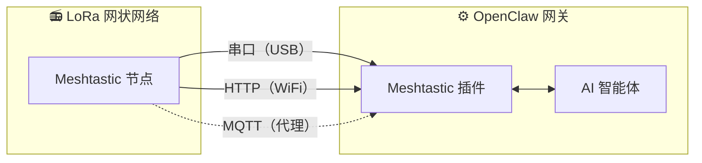

<p align="center">
  
</p>

# MeshClaw：OpenClaw 的 Meshtastic 频道插件

<p align="center">
  <a href="https://www.npmjs.com/package/@seeed-studio/meshtastic">
    
  </a>
  <a href="https://www.npmjs.com/package/@seeed-studio/meshtastic">
    
  </a>
</p>

<!-- LANG_SWITCHER_START -->
<p align="center">
  <a href="README.md">English</a> | <b>中文</b> | <a href="README.ja.md">日本語</a> | <a href="README.fr.md">Français</a> | <a href="README.pt.md">Português</a> | <a href="README.es.md">Español</a>
</p>
<!-- LANG_SWITCHER_END -->

MeshClaw 是一个 OpenClaw 频道插件，让你的 AI 网关能够通过 Meshtastic 收发消息——无需互联网、无需基站，只靠无线电波。无论在高山、海上，还是任何电网触达不到的地方，都能与 AI 助手对话。

⭐ 在 GitHub 给我们点 Star —— 这对我们很有激励！

> [!IMPORTANT]
> 这是用于 [OpenClaw](https://github.com/openclaw/openclaw) AI 网关的频道插件，而不是独立应用。请先准备一个运行中的 OpenClaw 实例（Node.js 22+）。

[文档][docs] · [硬件指南](#recommended-hardware) · [报告问题][issues] · [功能请求][issues]

## 目录

- [工作原理](#how-it-works)
- [推荐硬件](#recommended-hardware)
- [功能特性](#features)
- [能力与路线图](#capabilities--roadmap)
- [演示](#demo)
- [快速开始](#quick-start)
- [安装向导](#setup-wizard)
- [配置](#configuration)
- [故障排查](#troubleshooting)
- [开发](#development)
- [贡献](#contributing)

## 工作原理



该插件在 Meshtastic LoRa 设备与 OpenClaw AI 智能体之间建立桥接，支持三种传输模式：

- 串口（Serial）—— 通过 USB 直连本地 Meshtastic 设备
- HTTP —— 通过 WiFi/局域网连接设备
- MQTT —— 订阅 Meshtastic MQTT Broker，无需本地硬件

入站消息在到达 AI 前会经过访问控制（私信策略、群组策略、@提及门控）。出站回复会移除 Markdown 格式（LoRa 设备无法渲染），并按电台数据包大小限制进行分片发送。

## 推荐硬件

<p align="center">
  
</p>

| 设备                         | 适用场景               | 链接               |
| ---------------------------- | ---------------------- | ------------------ |
| XIAO ESP32S3 + Wio-SX1262 套件 | 入门级开发             | [购买][hw-xiao]    |
| Wio Tracker L1 Pro           | 便携式野外网关         | [购买][hw-wio]     |
| SenseCAP Card Tracker T1000-E | 小型追踪器             | [购买][hw-sensecap] |

没有硬件？MQTT 传输可通过 Broker 连接——不需要本地设备。

任何兼容 Meshtastic 的设备都可以使用。

## 功能特性

- AI 智能体集成 —— 将 OpenClaw AI 智能体与 Meshtastic LoRa 网状网络桥接，实现无需云端的智能通信

- 三种传输模式 —— 支持串口（USB）、HTTP（WiFi）和 MQTT

- 私信与群组频道的访问控制 —— 同时支持两种会话模式，包含私信允许列表、频道响应规则与@提及门控

- 多账户支持 —— 可同时运行多个独立连接

- 稳健的网状通信 —— 可配置重试的自动重连，优雅处理掉线

## 能力与路线图

该插件将 Meshtastic 视为一等公民的频道——就像 Telegram 或 Discord 一样——使 AI 对话与技能调用全部在 LoRa 电台上完成，无需互联网依赖。

| 离线查询信息                                         | 跨渠道桥接：离网发送、随处接收                      | 🔜 接下来要做的事：                                      |
| ---------------------------------------------------- | --------------------------------------------------- | -------------------------------------------------------- |
|       |        | 我们计划将节点的实时数据（GPS 位置、环境传感器、设备状态）注入 OpenClaw 的上下文，让 AI 监控网状网络健康状况，并在无需等待用户询问的情况下主动广播告警。 |

## 演示

<div align="center">

https://github.com/user-attachments/assets/837062d9-a5bb-4e0a-b7cf-298e4bdf2f7c

</div>

备用： [media/demo.mp4](media/demo.mp4)

## 快速开始

```bash
# 1. 安装插件
openclaw plugins install @seeed-studio/meshtastic

# 2. 引导式配置 —— 引导你选择传输方式、地区与访问策略
openclaw onboard

# 3. 验证
openclaw channels status --probe
```

<p align="center">
  
</p>

## 安装向导

运行 `openclaw onboard` 会启动交互式向导，引导你完成每一步配置。下面是每一步的含义以及如何选择。

### 1. 传输方式

网关如何连接到 Meshtastic 网状网络：

| 选项              | 描述                                                         | 需要准备                                                |
| ----------------- | ------------------------------------------------------------ | ------------------------------------------------------- |
| 串口（USB）       | 通过 USB 直连本地设备。可自动检测可用端口。                 | 通过 USB 插入的 Meshtastic 设备                         |
| HTTP（WiFi）      | 通过局域网连接设备。                                         | 设备 IP 或主机名（如 `meshtastic.local`）               |
| MQTT（Broker）    | 通过 MQTT Broker 连接到网状网络，无需本地硬件。              | Broker 地址、凭据与订阅主题                              |

### 2. LoRa 地区

> 仅适用于串口与 HTTP。MQTT 将从订阅主题推导地区。

设置设备的射频区域。必须符合当地监管要求，并与网状网络中其他节点一致。常见选项：

| 地区     | 频段               |
| -------- | ------------------ |
| `US`     | 902–928 MHz        |
| `EU_868` | 869 MHz            |
| `CN`     | 470–510 MHz        |
| `JP`     | 920 MHz            |
| `UNSET`  | 保持设备默认       |

完整列表参见 [Meshtastic 地区文档](https://meshtastic.org/docs/getting-started/initial-config/#lora)。

### 3. 节点名称

设备在网状网络中的显示名称。同时在群组频道中作为 @提及触发器使用——其他用户通过 `@OpenClaw` 来与机器人对话。

- 串口 / HTTP：可选——留空将自动从已连接设备读取。
- MQTT：必填——因为没有可读取名称的实体设备。

### 4. 频道访问（`groupPolicy`）

控制机器人是否以及如何在网状网络的群组频道中响应（例如 LongFast、Emergency）：

| 策略                 | 行为                                                         |
| -------------------- | ------------------------------------------------------------ |
| `disabled`（默认）   | 忽略所有群组频道消息。只处理私信。                           |
| `open`               | 在网状网络的每个频道中都响应。                               |
| `allowlist`          | 只在列出的频道中响应。向导会提示你输入频道名（逗号分隔，例如 `LongFast, Emergency`）。使用 `*` 作为通配符匹配全部。 |

### 5. 需要 @提及

> 仅当频道访问策略不是 `disabled` 时出现。

开启后（默认：是），机器人只会在有人@它的节点名时才在群组频道中响应（例如 `@OpenClaw 今天天气如何？`）。避免机器人对频道中的每条消息都进行回复。

关闭后，机器人会对允许频道中的所有消息进行响应。

### 6. 私信访问策略（`dmPolicy`）

控制谁可以向机器人发送私信：

| 策略                 | 行为                                                         |
| -------------------- | ------------------------------------------------------------ |
| `pairing`（默认）    | 新发送者会触发配对请求，需被批准后才能聊天。                 |
| `open`               | 网状网络中的任何人都可以自由向机器人发送私信。               |
| `allowlist`          | 只有 `allowFrom` 中列出的节点可以私信，其他都会被忽略。       |

### 7. 私信允许列表（`allowFrom`）

> 仅当 `dmPolicy` 为 `allowlist`，或向导判断需要时出现。

允许向机器人发送私信的 Meshtastic 用户 ID 列表。格式：`!aabbccdd`（十六进制用户 ID）。多个条目用逗号分隔。

<p align="center">
  
</p>

### 8. 账户显示名称

> 仅在多账户设置时出现。可选。

为账户分配易读的显示名称。例如，ID 为 `home` 的账户可显示为“Home Station”。如果跳过，将直接显示原始账户 ID。仅影响显示，不影响功能。

## 配置

引导式安装（`openclaw onboard`）已涵盖以下所有配置。详见[安装向导](#setup-wizard)。若需手动配置，可使用 `openclaw config edit` 编辑。

### 串口（USB）

```yaml
channels:
  meshtastic:
    transport: serial
    serialPort: /dev/ttyUSB0
    nodeName: OpenClaw
```

### HTTP（WiFi）

```yaml
channels:
  meshtastic:
    transport: http
    httpAddress: meshtastic.local
    nodeName: OpenClaw
```

### MQTT（Broker）

```yaml
channels:
  meshtastic:
    transport: mqtt
    nodeName: OpenClaw
    mqtt:
      broker: mqtt.meshtastic.org
      username: meshdev
      password: large4cats
      topic: "msh/US/2/json/#"
```

### 多账户

```yaml
channels:
  meshtastic:
    accounts:
      home:
        transport: serial
        serialPort: /dev/ttyUSB0
      remote:
        transport: mqtt
        mqtt:
          broker: mqtt.meshtastic.org
          topic: "msh/US/2/json/#"
```

<details>
<summary><b>所有选项参考</b></summary>

| 键                   | 类型                            | 默认值                | 说明                                                         |
| -------------------- | ------------------------------- | --------------------- | ------------------------------------------------------------ |
| `transport`          | `serial \| http \| mqtt`        | `serial`              |                                                              |
| `serialPort`         | `string`                        | —                     | 串口方式必填                                                 |
| `httpAddress`        | `string`                        | `meshtastic.local`    | HTTP 方式必填                                                |
| `httpTls`            | `boolean`                       | `false`               |                                                              |
| `mqtt.broker`        | `string`                        | `mqtt.meshtastic.org` |                                                              |
| `mqtt.port`          | `number`                        | `1883`                |                                                              |
| `mqtt.username`      | `string`                        | `meshdev`             |                                                              |
| `mqtt.password`      | `string`                        | `large4cats`          |                                                              |
| `mqtt.topic`         | `string`                        | `msh/US/2/json/#`     | 订阅主题                                                     |
| `mqtt.publishTopic`  | `string`                        | 自动推导              |                                                              |
| `mqtt.tls`           | `boolean`                       | `false`               |                                                              |
| `region`             | enum                            | `UNSET`               | `US`, `EU_868`, `CN`, `JP`, `ANZ`, `KR`, `TW`, `RU`, `IN`, `NZ_865`, `TH`, `EU_433`, `UA_433`, `UA_868`, `MY_433`, `MY_919`, `SG_923`, `LORA_24`。仅适用于串口/HTTP。 |
| `nodeName`           | `string`                        | 自动检测              | 显示名与 @提及触发器。MQTT 必填。                            |
| `dmPolicy`           | `open \| pairing \| allowlist`  | `pairing`             | 谁可以发送私信。见[私信访问策略](#6-dm-access-policy-dmpolicy)。 |
| `allowFrom`          | `string[]`                      | —                     | 私信允许列表的节点 ID，例如 `["!aabbccdd"]`                  |
| `groupPolicy`        | `open \| allowlist \| disabled` | `disabled`            | 群组频道响应策略。见[频道访问](#4-channel-access-grouppolicy)。 |
| `channels`           | `Record<string, object>`        | —                     | 按频道覆盖项：`requireMention`、`allowFrom`、`tools`         |

</details>

<details>
<summary><b>环境变量覆盖</b></summary>

这些环境变量可覆盖默认账户的配置（对于具名账户，YAML 优先生效）：

| 环境变量                   | 对应配置项          |
| ------------------------- | ------------------- |
| `MESHTASTIC_TRANSPORT`    | `transport`         |
| `MESHTASTIC_SERIAL_PORT`  | `serialPort`        |
| `MESHTASTIC_HTTP_ADDRESS` | `httpAddress`       |
| `MESHTASTIC_MQTT_BROKER`  | `mqtt.broker`       |
| `MESHTASTIC_MQTT_TOPIC`   | `mqtt.topic`        |

</details>

## 故障排查

| 症状                 | 排查要点                                                    |
| -------------------- | ----------------------------------------------------------- |
| 串口无法连接         | 设备路径是否正确？主机是否有权限？                           |
| HTTP 无法连接        | `httpAddress` 可达吗？`httpTls` 与设备设置一致吗？          |
| MQTT 收不到消息      | `mqtt.topic` 中的地区是否正确？Broker 凭据是否有效？         |
| 私信无响应           | `dmPolicy` 与 `allowFrom` 是否已配置？参见[私信访问策略](#6-dm-access-policy-dmpolicy)。 |
| 群组无回复           | `groupPolicy` 是否启用？频道是否在允许列表？是否需要@提及？参见[频道访问](#4-channel-access-grouppolicy)。 |

发现 Bug？请[提交 Issue][issues]，附上传输类型、配置（注意打码敏感信息），以及 `openclaw channels status --probe` 的输出。

## 开发

```bash
git clone https://github.com/Seeed-Solution/MeshClaw.git
cd MeshClaw
npm install
openclaw plugins install -l ./MeshClaw
```

无需构建步骤——OpenClaw 会直接加载 TypeScript 源码。使用 `openclaw channels status --probe` 进行验证。

## 贡献

- 若有 Bug 或功能请求，请[提交 Issue][issues]
- 欢迎提交 PR —— 请保持与现有 TypeScript 代码风格一致

<!-- Reference-style links -->
[docs]: https://meshtastic.org/docs/
[issues]: https://github.com/Seeed-Solution/MeshClaw/issues
[hw-xiao]: https://www.seeedstudio.com/Wio-SX1262-with-XIAO-ESP32S3-p-5982.html
[hw-wio]: https://www.seeedstudio.com/Wio-Tracker-L1-Pro-p-6454.html
[hw-sensecap]: https://www.seeedstudio.com/SenseCAP-Card-Tracker-T1000-E-for-Meshtastic-p-5913.html