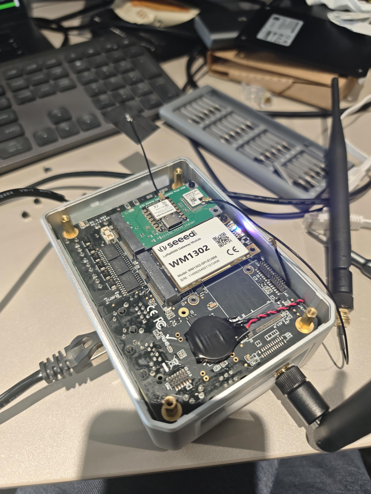
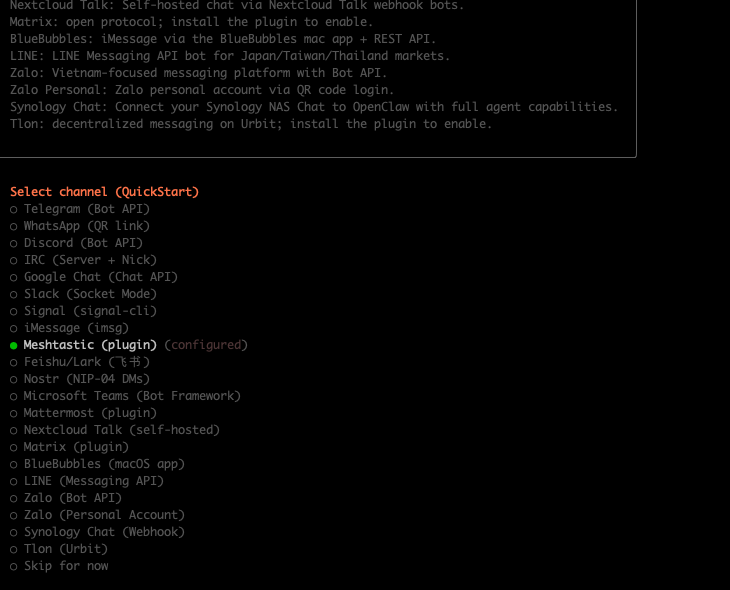
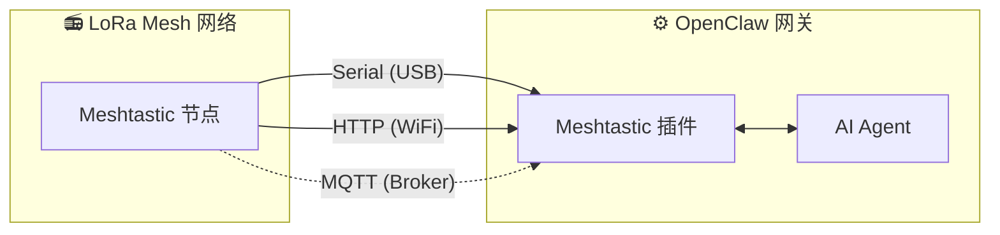

# OpenClaw Meshtastic 插件

[](https://www.npmjs.com/package/@seeed-studio/meshtastic)
[](https://www.npmjs.com/package/@seeed-studio/meshtastic)

[English](README.md) | **[中文](README.zh-CN.md)**

[OpenClaw](https://github.com/openclaw/openclaw) 的 [Meshtastic](https://meshtastic.org/) LoRa 网状网络频道插件。通过 USB 串口、HTTP 或 MQTT 将 AI 网关连接到 mesh 网络，无需云服务。

> [!IMPORTANT]
> 这是 [OpenClaw](https://github.com/openclaw/openclaw) AI 网关的**频道插件**，不是独立应用程序。你需要一个运行中的 OpenClaw 实例（Node.js 22+）才能使用。

[文档][docs] · [硬件指南](#推荐硬件) · [报告问题][issues] · [功能请求][issues]

<p align="center">
  
</p>

## 目录

- [快速开始](#快速开始)
- [工作原理](#工作原理)
- [推荐硬件](#推荐硬件)
- [演示](#演示)
- [功能特性](#功能特性)
- [设置向导](#设置向导)
- [配置](#配置)
- [故障排查](#故障排查)
- [开发](#开发)
- [贡献](#贡献)

## 快速开始

```bash
# 1. 安装插件
openclaw plugins install @seeed-studio/meshtastic

# 2. 交互式设置 — 引导完成传输方式、频率区域、访问策略等配置
openclaw onboard

# 3. 验证
openclaw channels status --probe
```

<p align="center">
  
</p>

## 工作原理



本插件在 Meshtastic LoRa 设备和 OpenClaw AI Agent 之间架起桥梁，支持三种传输模式：

- **Serial** — 通过 USB 直连本地 Meshtastic 设备
- **HTTP** — 通过 WiFi / 局域网连接设备
- **MQTT** — 订阅 Meshtastic MQTT broker，无需本地硬件

入站消息经过访问控制（私信策略、群组策略、@mention 门控）后到达 AI。出站回复会自动去除 markdown 格式（LoRa 设备无法渲染），并按无线电包大小限制进行分片。

## 推荐硬件

<p align="center">
  
</p>

| 设备 | 适用场景 | 链接 |
|---|---|---|
| XIAO ESP32S3 + Wio-SX1262 套件 | 低成本离网节点 | [购买][hw-xiao] |
| Wio Tracker L1 Pro | 即插即用网关 | [购买][hw-wio] |
| SenseCAP Card Tracker T1000-E | 便携追踪器 | [购买][hw-sensecap] |

任何 Meshtastic 兼容设备均可使用。Serial 和 HTTP 直连设备；MQTT 完全不需要本地硬件。

## 演示

https://github.com/user-attachments/assets/a3e46e9d-cf5a-4743-9830-f671a1998ca0

备用链接：[media/demo.mp4](media/demo.mp4)

## 功能特性

- **私信和 mesh 频道** — 支持按频道设置独立规则
- **访问控制** — 私信策略（`open` / `pairing` / `allowlist`）、群组策略（`open` / `allowlist` / `disabled`）、@mention 门控、按频道白名单
- **多账户** — 同时运行独立的 serial、HTTP、MQTT 连接
- **区域感知** — 连接时自动设置设备区域，自动推导 MQTT topic 默认值
- **自动重连** — 弹性重试处理

## 设置向导

运行 `openclaw onboard` 会启动一个交互式向导，逐步引导你完成配置。以下是每一步的含义和选择建议。

### 1. 传输方式（Transport）

网关如何连接到 Meshtastic mesh 网络：

| 选项 | 说明 | 要求 |
|---|---|---|
| **Serial**（USB 串口） | 通过 USB 直连本地设备，自动检测可用端口。 | Meshtastic 设备已通过 USB 连接 |
| **HTTP**（WiFi） | 通过局域网连接设备。 | 设备 IP 或主机名（如 `meshtastic.local`） |
| **MQTT**（broker） | 通过 MQTT broker 连接 mesh 网络，无需本地硬件。 | broker 地址、凭据和订阅 topic |

### 2. LoRa 频率区域（Region）

> 仅 Serial 和 HTTP 模式需要。MQTT 模式从订阅 topic 中自动推导区域。

设置设备的无线电频率区域，必须与当地法规和 mesh 网络中其他节点一致。常用选项：

| 区域 | 频率 |
|---|---|
| `US` | 902–928 MHz |
| `EU_868` | 869 MHz |
| `CN` | 470–510 MHz |
| `JP` | 920 MHz |
| `UNSET` | 保持设备默认值 |

完整列表参见 [Meshtastic 区域文档](https://meshtastic.org/docs/getting-started/initial-config/#lora)。

### 3. 节点名称（Node Name）

设备在 mesh 网络中的显示名称，同时作为群组频道中的 **@mention 触发词** — 其他用户发送 `@OpenClaw` 即可与你的 bot 对话。

- **Serial / HTTP**：可选 — 留空会自动从连接的设备读取名称。
- **MQTT**：必填 — 没有物理设备可供读取名称。

### 4. 频道访问控制（Channel Access / `groupPolicy`）

控制 bot 是否以及如何响应 **mesh 群组频道**（如 LongFast、Emergency）中的消息：

| 策略 | 行为 |
|---|---|
| `disabled`（默认） | 忽略所有群组频道消息。仅处理私信。 |
| `open` | 在 mesh 上的**所有**频道中响应消息。 |
| `allowlist` | 仅在**指定频道**中响应。设置时会提示输入频道名称（逗号分隔，如 `LongFast, Emergency`）。使用 `*` 通配符匹配所有频道。 |

### 5. 需要 @mention 才回复（Require Mention）

> 仅在频道访问控制不为 `disabled` 时出现。

启用时（默认：**是**），bot 在群组频道中只有被 @mention 时才会回复（如 `@OpenClaw 天气怎么样?`），防止 bot 对频道中的每条消息都回复。

禁用时，bot 会回复允许频道中的**所有**消息。

### 6. 私信访问策略（DM Access Policy / `dmPolicy`）

控制谁可以给 bot 发送**私信（Direct Message）**：

| 策略 | 行为 |
|---|---|
| `pairing`（默认） | 新发送者会触发配对请求，审批通过后才能对话。 |
| `open` | mesh 上的任何人都可以自由私信 bot。 |
| `allowlist` | 仅 `allowFrom` 列表中的节点可以私信，其他人被忽略。 |

### 7. 私信白名单（DM Allowlist / `allowFrom`）

> 仅在 `dmPolicy` 为 `allowlist` 或向导判断需要时出现。

允许发送私信的 Meshtastic 节点 ID 列表。格式为 `!aabbccdd`（十六进制节点 ID），多个条目用逗号分隔。

### 8. 账户显示名称（Account Display Names）

> 仅在多账户配置时出现。可选。

为你的账户设置人类可读的显示名称。例如，ID 为 `home` 的账户可以显示为「家里基站」。如果跳过，系统直接使用原始 account ID。这是纯展示性的设置，不影响任何功能。

## 配置

交互式设置（`openclaw onboard`）涵盖以下所有内容。详细步骤说明参见[设置向导](#设置向导)。如需手动编辑，使用 `openclaw config edit`。

### Serial（USB 串口）

```yaml
channels:
  meshtastic:
    transport: serial
    serialPort: /dev/ttyUSB0
    nodeName: OpenClaw
```

### HTTP（WiFi）

```yaml
channels:
  meshtastic:
    transport: http
    httpAddress: meshtastic.local
    nodeName: OpenClaw
```

### MQTT（broker）

```yaml
channels:
  meshtastic:
    transport: mqtt
    nodeName: OpenClaw
    mqtt:
      broker: mqtt.meshtastic.org
      username: meshdev
      password: large4cats
      topic: "msh/US/2/json/#"
```

### 多账户

```yaml
channels:
  meshtastic:
    accounts:
      home:
        transport: serial
        serialPort: /dev/ttyUSB0
      remote:
        transport: mqtt
        mqtt:
          broker: mqtt.meshtastic.org
          topic: "msh/US/2/json/#"
```

<details>
<summary><b>全部选项参考</b></summary>

| 配置项 | 类型 | 默认值 | 说明 |
|---|---|---|---|
| `transport` | `serial \| http \| mqtt` | `serial` | |
| `serialPort` | `string` | — | Serial 模式必填 |
| `httpAddress` | `string` | `meshtastic.local` | HTTP 模式必填 |
| `httpTls` | `boolean` | `false` | |
| `mqtt.broker` | `string` | `mqtt.meshtastic.org` | |
| `mqtt.port` | `number` | `1883` | |
| `mqtt.username` | `string` | `meshdev` | |
| `mqtt.password` | `string` | `large4cats` | |
| `mqtt.topic` | `string` | `msh/US/2/json/#` | 订阅 topic |
| `mqtt.publishTopic` | `string` | 自动推导 | |
| `mqtt.tls` | `boolean` | `false` | |
| `region` | 枚举 | `UNSET` | `US`、`EU_868`、`CN`、`JP`、`ANZ`、`KR`、`TW`、`RU`、`IN`、`NZ_865`、`TH`、`EU_433`、`UA_433`、`UA_868`、`MY_433`、`MY_919`、`SG_923`、`LORA_24`。仅 Serial/HTTP 模式。 |
| `nodeName` | `string` | 自动检测 | 显示名称及 @mention 触发词。MQTT 模式必填。 |
| `dmPolicy` | `open \| pairing \| allowlist` | `pairing` | 私信访问策略。详见[私信访问策略](#6-私信访问策略dm-access-policy--dmpolicy)。 |
| `allowFrom` | `string[]` | — | 私信白名单节点 ID，如 `["!aabbccdd"]` |
| `groupPolicy` | `open \| allowlist \| disabled` | `disabled` | 群组频道响应策略。详见[频道访问控制](#4-频道访问控制channel-access--grouppolicy)。 |
| `channels` | `Record<string, object>` | — | 按频道覆盖：`requireMention`、`allowFrom`、`tools` |

</details>

<details>
<summary><b>环境变量覆盖</b></summary>

以下环境变量覆盖默认账户的配置（YAML 中的命名账户配置优先）：

| 变量 | 等效配置项 |
|---|---|
| `MESHTASTIC_TRANSPORT` | `transport` |
| `MESHTASTIC_SERIAL_PORT` | `serialPort` |
| `MESHTASTIC_HTTP_ADDRESS` | `httpAddress` |
| `MESHTASTIC_MQTT_BROKER` | `mqtt.broker` |
| `MESHTASTIC_MQTT_TOPIC` | `mqtt.topic` |

</details>

## 故障排查

| 症状 | 检查项 |
|---|---|
| Serial 无法连接 | 设备路径是否正确？主机是否有权限？ |
| HTTP 无法连接 | `httpAddress` 是否可达？`httpTls` 是否与设备设置匹配？ |
| MQTT 收不到消息 | `mqtt.topic` 中的区域是否正确？broker 凭据是否有效？ |
| 私信无回复 | `dmPolicy` 和 `allowFrom` 是否已配置？详见[私信访问策略](#6-私信访问策略dm-access-policy--dmpolicy)。 |
| 群组频道无回复 | `groupPolicy` 是否已启用？频道是否在白名单中？是否需要 @mention？详见[频道访问控制](#4-频道访问控制channel-access--grouppolicy)。 |

发现 bug？请[提交 issue][issues]，附上传输方式、配置（隐去密钥）以及 `openclaw channels status --probe` 的输出。

## 开发

```bash
git clone https://github.com/Seeed-Solution/openclaw-meshtastic.git
cd openclaw-meshtastic
npm install
openclaw plugins install -l ./openclaw-meshtastic
```

无构建步骤 — OpenClaw 直接加载 TypeScript 源码。使用 `openclaw channels status --probe` 验证。

## 贡献

- [提交 issue][issues] 报告 bug 或提出功能请求
- 欢迎 Pull Request — 请保持与现有 TypeScript 代码风格一致

<!-- Reference-style links -->
[docs]: https://meshtastic.org/docs/
[issues]: https://github.com/Seeed-Solution/openclaw-meshtastic/issues
[hw-xiao]: https://www.seeedstudio.com/Wio-SX1262-with-XIAO-ESP32S3-p-5982.html
[hw-wio]: https://www.seeedstudio.com/Wio-Tracker-L1-Pro-p-6454.html
[hw-sensecap]: https://www.seeedstudio.com/SenseCAP-Card-Tracker-T1000-E-for-Meshtastic-p-5913.html
